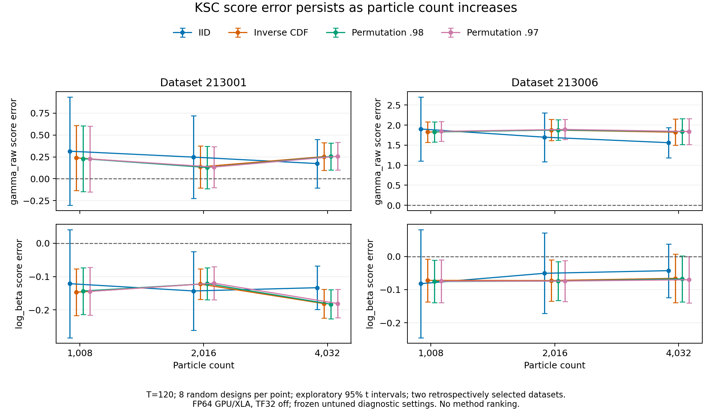
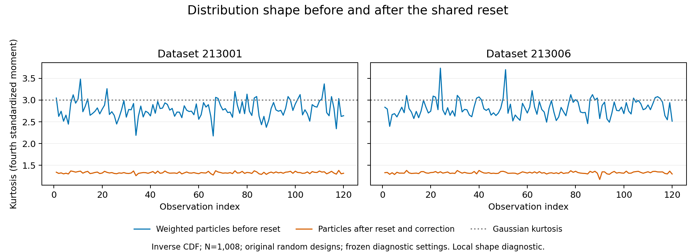

# KSC score discrepancy: completed analysis, 2026-09-29

All four methods still have substantial score error on the selected difficult dataset, and all four lose to the moment-matched Gaussian Kalman heuristic there. The investigation identifies a shared source of approximation error: the reset and higher-moment correction preserve the particle mean and variance but substantially change distribution shape and the next predictive likelihood and score. The estimated mean discrepancy remains across new random designs. All 48 checked analytical derivatives agree with finite differences of their own finite programs.

This is a completed explanatory investigation, not an accuracy repair or a method-ranking study. Retain all four methods for further research. The tested configurations do not qualify for accuracy or default promotion.

## Target and scope

The target is the log likelihood and its two-coordinate score for the **full seven-component KSC observation mixture**, with `theta=(gamma_raw, log_beta)=(1.5,0)`, `phi=Phi(gamma_raw)`, process variance 1, initial latent distribution `N(0,1)`, and prediction before each observation. The seven-component model itself approximates the native stochastic-volatility observation law. Its converged Gaussian-sum reference is a numerical integration calculation, not a single Gaussian Kalman filter or literal enumeration of all seven-component histories.

The investigation used FP64 TensorFlow GPU/XLA with TF32 off and verified memory growth. All new cells are **UNTUNED diagnostics**: the old T=120 controls were frozen to study the effects of particle count and numerical settings. Changed scopes inherit no tuning admission. Contract E, the analytical recursive score, dual-cap safeguards and all model/runtime code were retained.

Dataset 213001 was selected by seed order; dataset 213006 had the largest archived mean score-vector error across the four methods. They are retrospective cases, not a representative sample. Eight new random designs per case varied both initial clouds and subsequent process inputs. This is not a pure initialization-only ablation, and the initial probability law did not change. Three SQMC methods share their Halton inputs; their agreement is not independent confirmation.

Plan: [discrepancy analysis](../plans/sqmc-ksc-discrepancy-analysis-20260929.md), including the pre-execution skeptical review. The [reset diagnostic addendum](../plans/sqmc-ksc-reset-mechanism-addendum-20260929.md) was reviewed before implementation and execution. Both reviews were Codex self-reviews; no independent reviewer was used.

## Actual values, scores and uncertainty

The following tables use T=120 and N=4,032. Particle entries are means over eight random designs; the numbers after ± are Monte Carlo standard errors of those means. Absolute errors in the final columns are errors of the means. Mean absolute errors over individual designs are separately retained in the structured summary and individual errors in the CSV. The reference is deterministic to the numerical checks performed.

**Dataset 213001**

| Method | Mean log likelihood | Mean gamma score ± SE | Mean log-beta score ± SE | Absolute logL error | Absolute gamma error | Absolute beta error |
|---|---:|---:|---:|---:|---:|---:|
| Seven-mixture reference | -278.788318 | -0.406798 | -1.602529 | 0 | 0 | 0 |
| IID | -278.711999 | -0.233275 ± 0.117147 | -1.735838 ± 0.027784 | 0.076319 | 0.173523 | 0.133309 |
| Inverse CDF | -278.677110 | -0.153625 ± 0.067228 | -1.783642 ± 0.018153 | 0.111208 | 0.253173 | 0.181112 |
| Permutation .98 | -278.676921 | -0.152391 ± 0.065417 | -1.785412 ± 0.018273 | 0.111397 | 0.254407 | 0.182882 |
| Permutation .97 | -278.676546 | -0.149779 ± 0.066883 | -1.783496 ± 0.017899 | 0.111772 | 0.257019 | 0.180966 |

**Dataset 213006**

| Method | Mean log likelihood | Mean gamma score ± SE | Mean log-beta score ± SE | Absolute logL error | Absolute gamma error | Absolute beta error |
|---|---:|---:|---:|---:|---:|---:|
| Seven-mixture reference | -282.122686 | 5.912217 | -3.457002 | 0 | 0 | 0 |
| IID | -282.112215 | 7.472918 ± 0.160638 | -3.499732 ± 0.034146 | 0.010471 | 1.560700 | 0.042730 |
| Inverse CDF | -281.880108 | 7.734565 ± 0.138035 | -3.522937 ± 0.030919 | 0.242578 | 1.822348 | 0.065936 |
| Permutation .98 | -281.880243 | 7.750531 ± 0.137587 | -3.524636 ± 0.029504 | 0.242443 | 1.838313 | 0.067634 |
| Permutation .97 | -281.881376 | 7.751686 ± 0.137684 | -3.527140 ± 0.029702 | 0.241310 | 1.839469 | 0.070139 |

The near agreement of a likelihood value does not ensure agreement of its derivative. On dataset 213006, IID's mean log likelihood is only 0.01047 above the reference, while its gamma score is 1.56070 above it.

A score vector has a covariance matrix, not a unique scalar standard deviation. For design errors `e_r`, the report stores their sample covariance `S` and the estimated covariance of the mean, `S/8`. The coordinate standard errors above are the square roots of the diagonal of `S/8`; individual-design standard deviations equal these SEs times `sqrt(8)`. The mean of `||e_r||` and `||mean(e_r)||` are different quantities and are both preserved. Exploratory 95% Student-t intervals use 7 degrees of freedom and depend on small-sample distributional assumptions. They are conditional on each fixed, retrospectively selected dataset and do not support population or method-ranking claims.

The original inverse-CDF design on dataset 213006 had gamma error 3.86049; the eight new N=1,008 designs averaged 1.82570 with SE 0.10863. Thus the original realization was substantially worse than the new-design average. This is concrete evidence that random design matters and a warning that eight replications may miss rare, large errors. The exploratory intervals are not reliable tail bounds.

At N=4,032 on dataset 213006, the exploratory intervals for mean gamma error are [1.181,1.941] for IID, [1.496,2.149] for inverse CDF, [1.513,2.164] for permutation .98, and [1.514,2.165] for permutation .97. A persistent conditional mean discrepancy remains at the tested particle counts. This does not prove an asymptotic bias or inconsistency theorem.

## Cheap comparisons expose the accuracy failure

Three simple adversaries were constructed before execution: a zero score (ignore local parameter information), the exact first-observation mixture score (discard later observations), and a moment-matched Gaussian Kalman score (collapse the observation mixture). The table reports Euclidean score error in the (gamma_raw, log_beta) coordinates against the full-mixture reference. Particle entries are the **mean norm error ± its SE** at N=4,032; heuristic entries are deterministic on each dataset.

| Method | Dataset 213001 | Dataset 213006 |
|---|---:|---:|
| Zero score | 1.653356 | 6.848735 |
| First observation only | 1.609320 | 6.703578 |
| Gaussian Kalman heuristic | 0.511990 | 0.016064 |
| IID | 0.349318 ± 0.062481 | 1.563756 ± 0.160834 |
| Inverse CDF | 0.335483 ± 0.051121 | 1.824842 ± 0.139037 |
| Permutation .98 | 0.335980 ± 0.050113 | 1.840718 ± 0.138528 |
| Permutation .97 | 0.337003 ± 0.051813 | 1.841962 ± 0.138676 |

The Gaussian heuristic's score on dataset 213006 is (5.922090, -3.469673), close to the full-mixture reference (5.912217, -3.457002). Its error is about 0.0161, versus particle mean errors of 1.56–1.84. This observed conditional failure is an accuracy-promotion veto under the plan. It neither makes the Gaussian model the correct comparator nor establishes that it is generally superior. The two datasets give different descriptive comparisons, and no ranking among the four particle methods is supported here.

## What the numerical checks establish

Same-input replay reproduced all eight archived T=120 values and score vectors exactly. The full-mixture references passed grid-size and domain checks and agreed with an independent density-grid reference. At T=120 the maximum recorded disagreement was below 3.5e-13.

All 48 branch-matched finite-difference checks passed: two datasets, four routes, T=10/50/120 and both coordinates. Each accepted check used two adjacent step sizes with unchanged ancestry and stable centered differences. The largest accepted derivative difference was 1.175e-5. No stable derivative mismatch or unresolved branch case was found. This checks the analytical derivative of the tested baseline finite program; it does not establish equality with the target likelihood score, certify every nonsmooth branch, or validate all changed numerical scopes.

All 192 particle-replication cells were valid. Increasing N from 1,008 through 2,016 to 4,032 reduced random-design variation in several comparisons, but did not remove the large gamma discrepancy on dataset 213006. At N=4,032, squared sample mean error accounts for 92.8–96.1% of the empirical mean squared vector error on that case. This is an exact sample decomposition, not an unbiased estimate of squared population bias.

All 144 numerical-control cells were also valid. The following numbers are the maximum absolute change in either score coordinate from the paired baseline, over the two datasets and two new designs used for these controls.

| Method | Flow 8→64 | Sinkhorn/balance 24/12→384/192 | Epsilon 102.4→25.6, with 96/48 iterations | Combined flow 64 and 384/192 |
|---|---:|---:|---:|---:|
| IID | 0.0310751 | 6.24394e-09 | 0.174245 | 0.0310751 |
| Inverse CDF | 0.146114 | 6.0666e-06 | 0.17421 | 0.146114 |
| Permutation .98 | 0.0979647 | 6.42815e-09 | 0.161056 | 0.0979647 |
| Permutation .97 | 0.0714877 | 6.3975e-09 | 0.15107 | 0.0714878 |

The tested solver refinements did not cure the discrepancy. Epsilon changes the regularized reset itself, so its comparison is not merely an iteration-convergence test. The full tables also contain flow 16/32, transport 96/48, and epsilon 409.6. Two designs make these sensitivity differences descriptive only. Smaller untested epsilon values, different designs, or properly retuned scopes have not been ruled out.

## The shared reset changes the distribution and predictive score

The diagnostic follows each route's original N=1,008 trajectory on both datasets. Immediately before reset it takes the weighted particles `x_j` and their analytical tangents. Immediately afterward it takes the actual corrected particles `x'_i` and their tangents. For the next observation, process noise can be integrated analytically:

    K_theta(x) = sum_k w_k Normal(y_next; phi*x + 2*log_beta + m_k, 1 + v_k).

The variance is `1+v_k` because the process variance is 1. The diagnostic compares `A=sum_j posterior_weight_j*K_theta(x_j)` with `B=sum_i outgoing_weight_i*K_theta(x'_i)`, and computes the total derivatives of `log(A)` and `log(B)`. Particle locations, normalized weights and direct parameter dependence are all differentiated. No new random draws enter this within-step comparison.

Matching means and variances preserves expectations of quadratic functions. It does not preserve this nonlinear mixture-density functional. The measured changes demonstrate that the actual reset plus correction changes the next predictive likelihood and score, independently of an initialization comparison.

| Dataset | Method | Mean kurtosis before | Mean kurtosis after | Within-group variance / total variance | Largest absolute next gamma-score change |
|---|---|---:|---:|---:|---:|
| 213001 | IID | 2.7727 | 1.3416 | 0.0980 | 0.2192 |
| 213006 | IID | 2.8167 | 1.3435 | 0.0983 | 0.3347 |
| 213001 | Inverse CDF | 2.7902 | 1.3323 | 0.0951 | 0.2235 |
| 213006 | Inverse CDF | 2.8168 | 1.3317 | 0.0949 | 0.2546 |
| 213001 | Permutation .98 | 2.7901 | 1.3323 | 0.0951 | 0.2233 |
| 213006 | Permutation .98 | 2.8168 | 1.3317 | 0.0949 | 0.2545 |
| 213001 | Permutation .97 | 2.7892 | 1.3255 | 0.0931 | 0.2246 |
| 213006 | Permutation .97 | 2.8160 | 1.3249 | 0.0928 | 0.2563 |

Across all eight traces, mean changes were at most 8.0e-15 and relative variance changes at most 1.36e-15. Nevertheless, average kurtosis fell from 2.77–2.82 to 1.32–1.34. The repeated residual design divides the particles into alternating positive and negative groups; only about 9.3–9.8% of total variance remained within those groups on average. Thus about 90% of the variance lay between the two group means. This is a measured concentration around two groups, not a claim that the finite-epsilon cloud has exactly two distinct points.

The mean absolute local change in next-observation log likelihood was 0.014–0.0185, with observed maxima around 0.09–0.116. The largest local gamma-score change was 0.3347. These are descriptive trajectory diagnostics; time points are dependent and no tail ranking is inferred. Every trace agreed with its normal value/score endpoint within 1.32e-13, and its increments summed back to that endpoint. The independent CPU value/tangent checks passed for the predictive functional.

There is also a code-level explanation for why increasing N alone may leave this problem intact. [The residual design](../../bayesfilter/highdim/sqmc_campaign_tf.py#L35) tiles `(+1,-1)` for d=1, regardless of N. [The transport kernel](../../bayesfilter/highdim/ledh_unified_reset_tf.py#L113) is `exp(-cost/(scale*epsilon))`. As epsilon tends to infinity, its normalized rows become identical, the barycenters coincide at the weighted mean, and covariance restoration using that repeated design produces only two locations. The same deterministic higher-moment map cannot turn exactly identical input points into distinct points. The finite-epsilon measurements are consistent with this limiting mechanism, but do not isolate epsilon, residual design and subsequent correction as separate causes.

The actual likelihood weights still evaluate all seven mixture components. A Gaussian approximation in the flow proposal does not make the weighted likelihood a one-Gaussian calculation. The endpoint call chain used here is the shared canonical executor, its unified Contract-E reset, and the shared higher-moment correction; no reduced filter was substituted.

Both sides of the local comparison already contain approximation error from earlier times. Summing these local differences would not decompose the full likelihood error: a reset change also changes every later trajectory. The record separately preserves the following step's finite-program integration error relative to the exact predictive functional of its reset cloud. We have identified a real shared distortion and a plausible contributor to the accumulated discrepancy, not its exclusive cause or global percentage contribution.

## Decision, uncertainty and terminal review

| Decision | Primary criterion status | Veto status | Main uncertainty | Next justified action | What is not concluded |
|---|---|---|---|---|---|
| Complete the discrepancy analysis | Derivative, replication, numerical and reset mechanisms discriminated on the declared cases | No reference, source, budget or numerical-validity veto fired | Two retrospective cases and finite ladders | Preserve findings; target reset distribution shape in a separate repair study | Full global error attribution |
| Retain all four research methods | All produced valid diagnostic outputs | Accuracy promotion veto on dataset 213006 against Gaussian heuristic | No supported method ranking | Compare repairs with fresh cases and scope-specific tuning | Inverse CDF, IID or either permutation is best |
| Make no accuracy/default promotion | Substantial target-score discrepancy remains | Heuristic failure and lack of target accuracy | No downstream or production validation | Validate any future repair against the full seven-mixture reference | HMC or default readiness |

| Inference status | Finding |
|---|---|
| Hard veto screen | Zero invalid saved numerical cells; zero failed GPU attempts; zero infrastructure retries. Accuracy-promotion sanity check failed on dataset 213006. |
| Statistically supported ranking | None among the four methods. Conditional coordinate intervals show persistent error on the selected difficult case. |
| Descriptive-only differences | Numerical-control sensitivity, method ordering, reset moment changes and local maxima. |
| Default readiness | Not established; all changed scopes are UNTUNED diagnostic variants. |
| Next evidence needed | A distribution-preserving reset/design candidate, direct source-versus-reset checks, scope-specific tuning, and untouched multi-dataset value/score comparisons with uncertainty. |

The strongest alternative explanation is another shared approximation—such as proposal integration or an untested numerical setting—contributing materially to the global error. The reset measurement would be overturned by failure of endpoint parity or of the independent predictive-functional calculation; both passed. Its importance for the full error would be weakened if a shape-preserving reset left the discrepancy unchanged. The weakest part of the present inference is global causal attribution: no repaired counterfactual filter was run. The numerical protections also lack a new non-harm calibration here; they were retained as frozen baseline choices, not promoted through this analysis.

The next smallest discriminating study is a reviewed comparison of richer fixed residual designs and distribution-shape preservation, with existing safeguards retained, followed by exact predictive-functional and full-reference tests. It should distinguish the reset from subsequent correction and evaluate both values and scores on fresh data. That is a new repair campaign, not an unfinished phase of this analysis.

Engineering, numerical and scientific conclusions remain separate. Engineering checks establish replay, endpoint parity, input pairing and source stability. Numerical checks establish validity of the evaluated programs and agreement of the tested derivatives with their finite programs. The scientific result is persistent target-score error plus a directly measured local reset distortion. Correctly differentiating an approximation does not make its derivative the target score.

The terminal audit passed **20 arithmetic, pairing, source, hardware, budget and trace checks**. Five CPU derivative-classification tests and three independent predictive-functional value/tangent tests passed. Both generated figures were visually inspected for labels, intervals, legends and clipping. Review was performed by the same agent and executable independent calculations; an independent human/model review remains absent.

## Changes, compute and evidence

The changes add the discrepancy runner, trace-only mechanism diagnostic, reporting/plotting and terminal audit scripts, two focused test files, the reviewed plan/addendum, versioned results and this note. No filtering model, runtime algorithm, safeguard, package/environment, HMC consumer or production default was changed. No merge or push belongs to this follow-up.

All 21 GPU-owning worker attempts completed successfully. Their wall time, including initialization and compilation, was **7081.021525 seconds (1.966950 GPU-hours)**. Prior charged use was 24462.190031 seconds. Aggregate use is **31543.211557/43,200 seconds (8.762003/12 hours)**, leaving **11656.788443 seconds (3.237997 hours)**. The old reserve is already included in prior use and was not counted twice. The elapsed deadline remains `2026-09-30T16:15:40.010888+00:00`. CPU-only reporting and tests intentionally hid GPUs and incurred no GPU charge.

The [complete tables](../plans/artifacts/sqmc-ksc-discrepancy-20260929/attempt-01/analysis-01/report.md), [per-evaluation CSV](../plans/artifacts/sqmc-ksc-discrepancy-20260929/attempt-01/analysis-01/values-and-scores.csv), [structured summary with SD, SE and covariance](../plans/artifacts/sqmc-ksc-discrepancy-20260929/attempt-01/analysis-01/summary.json), and [all 376 evaluations with traces](../plans/artifacts/sqmc-ksc-discrepancy-20260929/attempt-01/analysis-01/all-evaluations.json) preserve the numerical evidence. The [terminal audit](../plans/artifacts/sqmc-ksc-discrepancy-20260929/attempt-01/analysis-01/terminal-validation.json), [CPU reporting manifest](../plans/artifacts/sqmc-ksc-discrepancy-20260929/attempt-01/postprocessing-manifest-01.json), [GPU budget ledger](../plans/artifacts/sqmc-ksc-discrepancy-20260929/budget.json), per-attempt manifests/logs and phase source snapshots preserve commands, seeds, hardware, wall time and provenance. Execution began at commit `023e106102c89ee9d4787df3a55fbf5f68b88ecf`; new diagnostic source bytes are preserved in the snapshots. Earlier campaign results remain unchanged.
