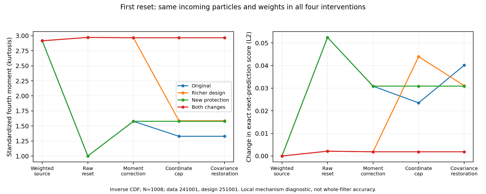
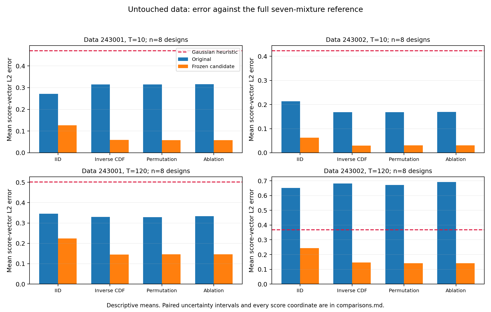

# KSC reset/protection repair results — 2026-09-29

Status: complete; recovered and reviewed on 2026-09-30. All 38 GPU units and the balanced eight-design comparison finished before the saved agent stalled.

The combined change removes most of the observed fourth-moment distortion and supports a limited repair for the three SQMC methods at T=10. It fails the general repair criterion: validation rejects five of eight route/horizon selections, and every T=120 candidate increases likelihood error beyond the allowed guard on untouched dataset 243002. All four original baselines also lose to the Gaussian heuristic on that long-horizon dataset. The repaired candidates pass that heuristic screen, but this does not override their failed validation and value criteria. All four ancestry methods remain research candidates.

The [reviewed plan](../plans/sqmc-ksc-reset-repair-plan-20260929.md) and [literature assessment](../plans/sqmc-ksc-reset-repair-literature-20260929.md) define this experiment. Complete evidence is under [attempt-01](../plans/artifacts/sqmc-ksc-reset-repair-20260929/attempt-01/).

## What changed and what was tested

The shared Contract E implementation gained an optional fixed residual design with 1,008 distinct normal quantiles and an optional standardized cap with an identity region. The latter leaves coordinates inside radius 8 unchanged and compresses only the tails. Radius 8 was the smallest of 2, 4 and 8 that left all declared healthy fixtures and their derivatives unchanged; score accuracy played no part in that choice. The diagonal trust region and pairwise protection remain active. The final affine covariance restoration can expand the capped cloud, so this is not a hard bound on final particles.

The current defaults are unchanged. Both extensions call the shared general correction through the full analytical LEDH executor, with the UKF covariance lifecycle and Contract E direct moment/weight and transport derivatives. No scalar replacement, autodiff score, HMC run or canonical tuning/admission artifact was introduced. New optional stage traces preserve clouds and analytical tangents before and after each operation.

This comparison fixes N=1008, scalar KSC at gamma=1.5 and log_beta=0, FP64, GPU/XLA with TF32 off, and T=10 or 120. T=10 is a prefix of the corresponding T=120 dataset. The target is the full seven-component observation mixture. One-component Gaussian Kalman results are labeled as a heuristic, never as the exact target. Five fresh synthetic datasets separate calibration, validation and untouched evaluation; the latter has two datasets.

The 15 full-mixture references passed three quadrature refinements (801/40, 1201/40 and 1201/48) and an independent density-grid recurrence under the predeclared 1e-7 tolerance on likelihood and both score coordinates. Four GPU call-chain checks passed 16 branch-matched finite-difference coordinate checks at T=2 and T=10. These checks support differentiation of the implemented finite program at those points; they do not prove that its score equals the KSC likelihood score.

## The local mechanism

All four interventions below start from exactly the same first-step particles and weights. The reference column is the weighted incoming cloud. The values are standardized fourth moments, so subsequent scalar affine mean/variance restoration cannot recover a fourth moment lost by the cap.

| Intervention | Incoming cloud | Raw reset | Moment correction | Coordinate cap | Covariance restoration |
|---|---:|---:|---:|---:|---:|
| Original | 2.916221 | 1.000473 | 1.577655 | 1.328293 | 1.328293 |
| Richer design only | 2.916221 | 2.972274 | 2.966277 | 1.586420 | 1.586420 |
| New protection only | 2.916221 | 1.000473 | 1.577655 | 1.577655 | 1.577655 |
| Both | 2.916221 | 2.972274 | 2.966277 | 2.966277 | 2.966277 |

The repeated residual design first collapses kurtosis toward one. Moment correction partially restores it; the original coordinate cap then removes much of that recovery. A richer residual design alone is also distorted by the old cap. Both changes together give final kurtosis 2.9663 against incoming 2.9162. Their first-step exact next-prediction score change is 0.001866 in L2, compared with 0.040112 for the original reset. This is a local distribution-preservation diagnostic, not error against the true filtering distribution.

Mean and variance restoration errors remain at about 1e-15. However, first-step skewness residual is still 0.1626 with both changes, versus 0.1998 originally. Reversing the quantile order changes it to 0.2049, demonstrating correspondence sensitivity. Later-step averages follow different trajectories and are not fixed-cloud counterfactual comparisons. The scalar model has no off-diagonal state-coordinate pairs for the pairwise co-moment correction.

The stage trace records effective terminal epsilon as the control multiplied by the actual cost scale. Under control 102.4 it spans roughly 190–303 in these trajectories. The accuracy ladder also tests control 25.6, with the same 24 Sinkhorn and 12 terminal balancing steps. The existing row-error and column-TV thresholds remain 1e-6 and 1e-4. Solver validity does not establish negligible regularization bias.

## Frozen selection and independent validation

Seven arms per route/horizon distinguish design, protection, their combination, four/eight moment-correction iterations, and lower terminal regularization. Calibration used two datasets and two designs per dataset. It chose minimum mean score-vector error among valid arms satisfying the value-error guard. The following untouched validation dataset then tested those frozen choices with two fresh designs.

All chosen arms use the richer design, the calibrated protection and eight correction steps. Epsilon 25.6 is selected where shown; otherwise it remains 102.4. A validation failure rejects that selected repair for nomination. It does not imply that the implementation crashed or that all future distribution-preserving repairs must fail.

| Method | T | Frozen arm | Mean score L2 error: original → candidate | Mean absolute value error: original → candidate | Validation |
|---|---:|---|---:|---:|---|
| IID | 10 | steps8 | 0.082175 → 0.093201 | 0.078530 → 0.141842 | Fail |
| IID | 120 | epsilon25 | 0.381482 → 0.431605 | 0.596813 → 0.433676 | Fail |
| Inverse CDF | 10 | epsilon25 | 0.066595 → 0.010528 | 0.011069 → 0.012307 | Pass |
| Inverse CDF | 120 | steps8 | 0.073887 → 0.121654 | 0.548057 → 0.084772 | Fail |
| Permutation | 10 | epsilon25 | 0.066328 → 0.009831 | 0.010833 → 0.015942 | Pass |
| Permutation | 120 | steps8 | 0.066158 → 0.123429 | 0.552193 → 0.083290 | Fail |
| Permutation ablation | 10 | epsilon25 | 0.066767 → 0.009831 | 0.010872 → 0.015942 | Pass |
| Permutation ablation | 120 | steps8 | 0.073987 → 0.123429 | 0.554177 → 0.083290 | Fail |

## Untouched comparison and uncertainty

All 16 method/horizon/dataset cells contain eight paired designs. The [complete comparison tables](../plans/artifacts/sqmc-ksc-reset-repair-20260929/attempt-01/analysis-01/comparisons.md) report actual likelihoods, both score coordinates, component standard errors, and paired score-error intervals. The [structured summary](../plans/artifacts/sqmc-ksc-reset-repair-20260929/attempt-01/analysis-01/summary.json) also preserves score-error covariance, uncertainty of the mean error vector, and bootstrap uncertainty of its norm; those quantities are different from the spread of replicate error norms.

Mean score-vector L2 error decreases in all 16 cells. Fifteen paired 95% intervals lie below zero; IID at T=120 on dataset 243001 has interval [-0.2654, 0.0443]. These are conditional, exploratory intervals over eight random designs on each fixed dataset, without multiple-comparison adjustment. They do not establish a ranking across methods or performance on a population of datasets.

Only the three SQMC T=10 selections satisfy validation and the untouched score/value criteria on both datasets. Their mean score errors decrease from about 0.315 to 0.058 on dataset 243001 and from about 0.169 to 0.031 on dataset 243002. IID's favorable untouched T=10 intervals cannot overturn its failed validation.

At T=120 on dataset 243002, mean absolute likelihood errors increase from 0.3058 to 0.4775 for IID, 0.1253 to 0.2136 for inverse CDF, 0.1254 to 0.2189 for permutation, and 0.1248 to 0.2189 for its ablation. Each exceeds the predeclared value-error guard. The corresponding score reductions therefore do not establish an acceptable general repair.

| Method | T | Validation | Untouched value guard on both datasets | Paired score intervals below zero on both datasets | Repair decision |
|---|---:|---|---|---|---|
| IID | 10 | Fail | Pass | Yes | Rejected for this scope |
| IID | 120 | Fail | Fail | No | Rejected for this scope |
| Inverse CDF | 10 | Pass | Pass | Yes | Limited nomination |
| Inverse CDF | 120 | Fail | Fail | Yes | Rejected for this scope |
| Permutation | 10 | Pass | Pass | Yes | Limited nomination |
| Permutation | 120 | Fail | Fail | Yes | Rejected for this scope |
| Permutation ablation | 10 | Pass | Pass | Yes | Limited nomination |
| Permutation ablation | 120 | Fail | Fail | Yes | Rejected for this scope |

The [conditional heuristic table](../plans/artifacts/sqmc-ksc-reset-repair-20260929/attempt-01/recovery-01/heuristic-comparison.md) compares both original and repaired configurations against Gaussian Kalman, zero score, and first-observation-only score in every untouched cell. The original configurations fail four comparisons, all against Gaussian Kalman at T=120 on dataset 243002. The candidates pass all 48 comparisons. These screens use descriptive mean errors and were never tuning targets; a pass is not evidence of superiority. The original baseline's failure also limits what an improvement over it establishes.

The figure shows descriptive means. The linked tables supply paired uncertainty; the failed validation and likelihood guard remain controlling even where the orange bar is lower.

## Implementation and evidence review

The focused CPU suite has 26 passing checks across cpu-checks-04.log (25) and zero-stage-after.log (1). Initial tests found a new cap constant rounded through FP32; it was corrected to a dtype-specific constant. A later static audit found absent stage fields in the existing zero-iteration early return; those fields now preserve the unchanged no-op clouds and tangents. This branch is unused by the positive-iteration campaign. Two new edge-test failures were caused by a missing required fixture argument, and one command used a nonexistent test path. The full logs preserve these distinctions. No GPU infrastructure retry has occurred.

Recovery reran the focused CPU suite: **55 passed**. Its first run found one stale expected error message in an existing test; the nonfinite-reference guard itself correctly rejected the input. Only the assertion was repaired. The numerical source closure exactly matches the last GPU manifest. A fresh [terminal audit](../plans/artifacts/sqmc-ksc-reset-repair-20260929/attempt-01/recovery-01/terminal-audit.json) passed 383 checks of all 38 units, snapshot hashes, data partitions, frozen selections, memory-growth/GPU/XLA provenance, and compute accounting. A separate [saved-result verification](../plans/artifacts/sqmc-ksc-reset-repair-20260929/attempt-01/recovery-01/verified-results.json) passed 67 checks, including all 525 stored error calculations and the balanced eight-design summaries.

## Decisions and remaining uncertainty

| Decision | Primary criterion status | Veto diagnostic status | Main uncertainty | Next justified action | Not concluded |
|---|---|---|---|---|---|
| Retain the optional shared implementation | Analytical derivative and call-chain parity checks pass | No nonfinite/covariance/reference failure in 525 evaluations | Safety fixtures and tested dimensions are limited | Keep as a named diagnostic configuration | Canonical admission, default readiness, or HMC readiness |
| Nominate the three SQMC T=10 repairs for further study | Both untouched cases pass the paired score and value criteria after validation | No candidate heuristic veto | Eight designs and two fixed untouched datasets; intervals are exploratory | Replicate on new datasets under a new plan if pursued | A ranking among inverse CDF and the two permutation routes |
| Reject IID's selected repair and every T=120 selected repair for nomination | Validation fails; all T=120 candidates also fail the value guard on one untouched case | These are candidate rejections, not harness invalidity | Remaining error may reflect residual geometry, correction effort, regularization, or accumulation | Investigate per-step score/value error on fresh data before further selection | Rejection of the shared reset-repair research direction |
| Close this authorized campaign | Every planned phase, report and balanced extension is complete | No continuation veto fired | Broad target accuracy remains unresolved | Preserve results and the remaining allowance | Permission to spend unused compute on a new campaign |

| Inference status | Finding |
|---|---|
| Hard veto screen | Numerical and reference checks pass. Validation rejects five of eight selections; the value guard rejects every T=120 candidate on dataset 243002. Original baselines lose to Gaussian Kalman in four untouched cells. |
| Statistically supported ranking | Exploratory conditional paired reductions support only the three SQMC T=10 nominations under the full contract. No overall method ranking is supported. |
| Descriptive-only differences | Moment traces, heuristic mean comparisons, runtime, and between-method mean differences. Favorable untouched scores for rejected selections do not override their vetoes. |
| Default-readiness | Not established. These remain optional FP64 diagnostic variants without canonical tuning/admission artifacts. |
| Next evidence needed | Independent fresh datasets and successful validation/value checks across horizons, with predeclared uncertainty and safety evaluation. |

The strongest alternative explanation is that the richer near-Gaussian residual design improves these particular data/design combinations without adequately preserving the evolving non-Gaussian filter. Its ordering sensitivity and remaining skewness mismatch support taking that possibility seriously. The untouched frozen comparison rules out retuning on these two datasets, but it does not identify how much of the gain comes from reset geometry, eight correction iterations, or reduced terminal regularization. The first-step factorial isolates a local mechanism only.

The broad repair conclusion would change if fresh scope-specific calibration, independent validation and untouched comparisons satisfied both score and likelihood criteria at T=120. Conversely, failure to replicate the T=10 result would remove the limited nomination. The weakest evidence is generalization: there are only two untouched datasets, one validation dataset, eight designs per untouched cell, one parameter point, and a narrow safety-calibration family.

## Compute, provenance and session recovery

The original aggregate allowance was 43,200 GPU-seconds. The [ledger](../plans/artifacts/sqmc-ksc-reset-repair-20260929/budget.json) reconciles 31,543.211557 prior seconds plus 4,709.920766 seconds for this repair campaign, totaling **36,253.132322 seconds (10.0703 GPU-hours)**. The unused allowance is **6,946.867678 seconds (1.9297 GPU-hours)** under the original deadline, 2026-09-30 16:15:40 UTC. No further GPU work was run during recovery. All 38 GPU units finished successfully; no GPU retry was needed.

Every unit has its exact command, git/source snapshot, environment, data/design seeds, start/end/wall time, and device/memory policy in its manifest; the terminal audit indexes all result and manifest paths. Numerical checks ran in the existing tftwogpu environment. Recovery CPU checks explicitly set CUDA_VISIBLE_DEVICES=-1. The saved figure was visually inspected.

The saved agent stopped after repeated provider HTTP 502 responses, followed by a failed pre-sampling remote compaction request. The [session diagnosis](../plans/artifacts/sqmc-ksc-reset-repair-20260929/attempt-01/recovery-01/session-diagnosis.json) preserves the exact session path and final error events without copying its instruction payloads. The underlying gateway fault remains unverified. The GPU campaign had already completed; fresh-session recovery finalized the evidence and report. A separate bubblewrap sandbox-startup failure required trusted local commands. No environment, model-provider settings, numerical results, or thresholds were changed during recovery.
