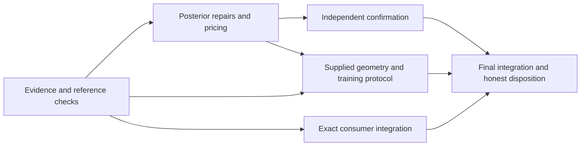

# HMC remaining-gap repair and validation program

Status: execution underway, 2026-09-24. A's reconciliation, independent checks
and narrow repairs are complete; B completed its saved-array diagnosis and all
eight prospective GPU fits. C2's first confirmation attempt stopped after
three per-fit timeouts, with nine of 256 fits completed on frozen source.
No confirmation process is active. D completed 16 training-price arms; E's exact inputs remain
missing. F's affected tests and official book passed, with final statistical
disposition pending C2. Exact results and limitations are in the
[execution checkpoint](bayesfilter-hmc-remaining-gap-execution-2026-09-24.md).
The [current result](bayesfilter-hmc-remaining-gap-results-2026-09-24.md) gives
the full requirement/status table and the revised learned-mixture capacity issue.
Planning source is
`622d9a9ed028659328b6386f9e9de7f368e7bba3` on `main`. Unrelated dirty Q20,
training, governance, chapter 26b and bibliography work is outside this scope.

This is the follow-on amendment to the
[master](bayesfilter-hmc-repair-master-program-2026-09-16.md), not a restart of
M31--M38. The previous program's results and unclosed requirements retain their
original evidence and source identities.

## Pre-execution planning audit

The original planning task was to diagnose the remaining gaps and produce a
coherent plan. Read-only source inspection, extraction of already recorded counts and
deterministic statistical-design arithmetic are appropriate. They cannot
establish new sampler performance, calibration or learned-map quality.

The design calculation will reproduce exact binomial-screen boundaries using
standard-library binomial probabilities, compare sample-size choices without
changing the inherited confidence level or pass thresholds, and price complete
inventories from explicitly descriptive historical timings. It will record its
inputs, source hashes, assumptions and limits in
`artifacts/hmc-remaining-gaps-2026-09-24/planning/design-arithmetic.json`.
Checks include the published M31 boundaries (128 fits require 122 successes;
256 require 240), and the corresponding upper-screen symmetry. No new Monte
Carlo draws, TensorFlow import, GPU access or environment mutation is needed.

Material flaws found in the previous planning interpretation:

* A failed lower-confidence-bound screen is not proof that the true coverage
  is below the floor. Gaussian missing-output failures and beta-binomial
  fixed-count failures must be separated from optional-stopping hypotheses.
* Quantile precision does not use lugsail. Its own estimator, interval
  construction and independent-reference tests need explicit investigation.
* A 384-fit, 95%-planning-assurance design is one choice, not the minimum cost
  of a valid confirmation. Repeated endpoint tests are also one choice of
  detector; cheaper detectors answer different, explicitly stated questions.
* Complete independent fits are the statistical units. Sibling members,
  posterior draws, paired no-op arms and replays cannot inflate their count.
* `hmc_mass_adaptation`'s legacy state import is under `TYPE_CHECKING`; it is
  maintenance coupling, not evidence of a runtime import cycle.
* Missing consumer bundles and unknown adequate training cost remain real
  dependencies. A plan cannot close them by renaming smoke tests.

Planning audit passes for the bounded inspection and arithmetic above. The
complete repair program, cost decisions and terminal review are recorded below
before any implementation or research execution is proposed.

## 1. What is closed, and what is still open

The two public tuners already implement the common candidate-set lifecycle.
Per-L epsilon measurement, fresh verification, retention of every verified
pair, typed replay, failure accounting and posterior-only convergence checks
have executable coverage in the M31--M38 engineering matrix. The latest repair
also forwards posterior policies correctly and rejects stale completed-fit
reuse. There is no evidence in this audit that another tuning unification or
an R-hat tuning gate is needed.

The open work is narrower, but scientifically substantial:

| Requirement | Checked finding | What would close it |
| --- | --- | --- |
| R2a: reliable posterior delivery | M25 Gaussian: 119/128 delivered, seven warmup caps and two retained caps. Beta-binomial: two fits had verified siblings but no member at the predeclared L. | Fresh complete-fit delivery screen for a frozen readiness, allocation and member policy, with every missing outcome counted. |
| R2b: mean and quantile uncertainty | Lugsail is implemented. Finite-count calibration, quantile intervals and actual stopped intervals remain unresolved for the failing cells. | Independent estimator checks, causal diagnosis, then fresh pointwise coverage screens and empirical error/MCSE evidence. |
| R3: complete-procedure sensitivity | The named reference-mean engine, independent arithmetic and isolated public fits pass. Three independent GPU activations plus an exact no-op pass; confirmation stopped after nine complete fits and three timeouts. | Diagnose long fits before continuation within cumulative budgets; retain the full 128/64/64 denominator. |
| R4: global exploration | Mixture mode indicators reach the posterior assessor. Ordinary chains may still miss modes. Supplied-whitened funnel tests exercise a different question. | Matched reference checks for named geometry/start regimes; honest failure classification where a supported map does not fix exploration. |
| R5: real consumer integration | The two exact bootstrap paths are still absent in both MacroFinance checkouts. The unchanged MIDAS reference documents describe a different, fixed-loadings model. | Exact inputs for mechanics; a matching joint reference with uncertainty for posterior validation. |
| R6: maintainability and reference coverage | A removed two active compatibility dependencies. ArviZ checks now execute in a pinned isolated environment; one optional external fixture remains unavailable. The large legacy facade remains maintenance debt. | Preserve scoped import/replay parity; migrate other dependencies only with their actual callers and tests. |
| R7: learned-map quality | Composition and 16 GPU learning-curve/gradient/freeze arms pass; 512-update adequacy is unproved. The single-stage mixture map retains a Gaussian first marginal. | First check representable capacity, then adequate target-specific training, frozen map validation, fresh tuning and untouched model-coordinate posterior evidence. |
| R8: continued alignment | The last official book/reference revision is aligned for its tested scope. Future repairs must update it with the same source and evidence. | Final code/registry/book/reference/test/status agreement, without a second tuning guide. |

R1 remains closed **for its tested engineering scope**. An untested model,
backend or algorithm does not inherit that evidence. Float64 scope and the
position-field branch's conditional mechanics authority are documented limits,
not bugs to remove casually. A finite search need not find a usable pair for
every target, geometry or budget.

### Reinterpret the old failures accurately

The direct source is M25's
[public audit](artifacts/hmc-repair-master-2026-09-16/m25-r1/public-final-audit-r2/result.json).
It supplies a more discriminating baseline than the word “undercoverage”:

| Cell | Stopped covered / available / planned | Independent fixed covered / available / planned | Consequence |
| --- | --- | --- | --- |
| Gaussian x mean | 116 / 121 / 128 | 125 / 128 / 128 | Missing warmup outputs materially reduce overall success. |
| Gaussian y mean | 117 / 121 / 128 | 123 / 128 / 128 | Same distinction; no numerical health veto. |
| Gaussian x median | 118 / 121 / 128 | 123 / 128 / 128 | Quantile estimator needs its own check. |
| Gaussian y median | 116 / 121 / 128 | 126 / 128 / 128 | Same distinction. |
| Beta-binomial mean | 122 / 126 / 128 | 119 / 126 / 128 | The fixed comparator also misses the declared screen. |
| Beta-binomial median | 120 / 126 / 128 | 119 / 126 / 128 | Optional stopping alone is not an established explanation. |

All four Gaussian **available-interval** lower bounds exceed .90; their
**all-planned-fit** lower bounds do not. Conditional coverage is explanatory,
not permission to discard the seven missing fits. Two retained-cap intervals
are available even though their fits did not deliver a qualified posterior.
Consequently “an interval exists”, “the interval covers”, and “a qualified
posterior was delivered” must remain separate events. None of these results
proves that the true coverage probability is below .90: failing to establish a
floor and statistically establishing undercoverage are different conclusions.

The rotated-Gaussian M26 member is another distinct failure. Its fixed arm has
small R-hat but insufficient precision after 60,000 draws per chain; a larger
readiness window alone cannot repair it. An identity-based sibling policy
and quantity-scaled allocation need evaluation without deleting that member.

## 2. Research intent and nonnegotiable boundaries

Main question: after valid candidate-set tuning, can the declared posterior
procedure deliver accurate estimates with honestly estimated uncertainty and
detect specified implementation defects at a known rate, at an affordable cost?

The candidate is a **posterior assessment/allocation policy and validation
procedure**, not a replacement HMC tuner. Retain both public tuners and their
registry authority. Keep R-hat, ESS, MCSE, exact truth, validation p-values and
map-selection scores out of tuning membership, ranking, epsilon repair and
candidate scheduling. A changed map still requires a new scope and retuning.

| Item | Role and interpretation |
| --- | --- |
| Public lifecycle invariants, numerical value/score/coordinate identities, stream separation, restored checkpoints | Engineering pass criteria; corruption is an affected-run continuation veto until repaired. |
| Warmup readiness, posterior R-hat, declared ESS and precision | Posterior delivery requirements only; a cap is a failed candidate outcome and a repair trigger, not a reason to stop the whole program. |
| All-fit delivery and interval coverage lower bounds | R2 promotion criteria, defined below. |
| Full-fit false-alarm upper bound and defect-power lower bound | R3 promotion criteria for the declared detector only. |
| Known mode mass, model-coordinate means/quantiles/tails and independent reference | Posterior validity criteria in the declared geometry cells; failure vetoes that posterior or learned map. |
| Loss, acceptance, observed speed, ESS per gradient, pilot MCSE, short-chain comparisons | Explanatory or developmental nomination evidence; no unsupported stochastic ranking. |
| Invalid target/Jacobian, corrupted archive, missing required diagnostics, lost source/stream identity, exhausted total allowance | Continuation veto for the affected experiment. A localized infrastructure repair may resume with the same contract and remaining budget. |
| Missing exact consumer bundle | Blocks that consumer cell only. |

Expected failure mechanisms are short-window readiness, poor finite-count
variance estimation, quantile approximation error, residual initialization
bias, optional stopping, slow retained members, and residual/global geometry.
The program must distinguish these before proposing numerical defaults.

No finite diagnostic certifies sufficient burn-in or global convergence for
all targets. No finite model matrix proves general posterior correctness.
No ordinary-centered-funnel success requirement is reintroduced. No result
here qualifies an arbitrary proposal field for exact-score posterior authority.
New scientific policies are optional, identified candidates until their own
validation passes; a new universal default needs a separate argument.

## 3. Finite work packages and dependencies

Use six work packages, not another sequence of open-ended next-pilot phases.
All have a concrete exit record, including failed or unfunded scientific cells.

| Work | Deliverable | Dependency and exit |
| --- | --- | --- |
| A — independent evidence and narrow structural repair | Cause-separated old-result inventory, estimator reference checks, dependency cleanup, reproducible test environment. | Starts first. Exact engineering checks pass, or an explicit discrepancy is assigned to B. |
| B — posterior mechanism repair | Tested optional fixes, bounded causal experiments, one frozen posterior policy per confirmation cell and realistic prices. | A; stop development at its declared alternatives/budget, not at the first candidate failure. |
| C — independent statistical confirmation | Complete R2 and R3 inventories on frozen code/policies, or a quantified funding shortfall before launch. | A/B; no confirmation based on pilot reuse or shortened denominators. |
| D — geometry and learned-map branch | Supplied-map/global-exploration matrix; target-specific training protocol and, if funded, independently validated maps. | A; serious learned work additionally needs B's assessment and its own adequate priced protocol. |
| E — exact consumers | Input/reference audit, exact public-route integration and local reply. | Inventory now; numerical work when the corresponding bundle exists. |
| F — terminal integration | Affected tests, official guide, requirement/result matrix and reconciled resources. | Always runs after A--E have dispositions. Scientific gaps stay open unless their criteria passed. |



Each work package refreshes **the same inventory and checkpoint** with finding,
failure class, repair, tests, actual cost, remaining allowance and next branch.
It does not invent a new phase number, diagnostic criterion or approval token.
At most one combined posterior-policy revision per target is nominated for
confirmation after the developmental comparisons below. A failed confirmation
is preserved; it cannot be repaired by repeatedly increasing N or changing the
test until a confidence bound crosses its floor.

## A. Independent evidence and bounded structural repair

1. Reconcile the existing M21/M25 full-fit inventory, M26 member failures and
   M31--M38 results into a per-fit table. Keep missing selected member, warmup
   cap, retained cap, invalid numerical evidence, interval availability,
   interval coverage and qualified delivery in separate columns. Include
   source, target/data, coordinates, member rule, estimator and stop policy.
   Reanalysis of these records is **development**, never fresh confirmation.
2. Complete independent R-hat/bulk/tail ESS reference tests in a compatible
   diagnostic environment. Prefer an already installed matching environment;
   otherwise prepare an isolated, pinned test environment under normal tool
   permissions. Do not mutate `tfgpu` broadly or remove `importorskip` merely
   to hide the missing reference. Record imported versions and executed/skipped
   tests. ArviZ checks cover the Stan/ArviZ estimator, not the deliberately
   different TFP positive-pairs mean/quantile option.
3. Add the missing direct quantile-precision reference matrix: IID continuous
   draws, persistent and antithetic chains, odd counts, rejection ties, bounded
   beta quantities, unobserved events and constant chains. Check indicator
   construction, chain splitting, quantile convention, order-statistic indices
   and unavailable evidence against a separate diagnostic implementation.
   Trace `execute_pipeline -> run_hmc_posterior -> assess_posterior ->
   precision_report -> quantile_precision`, not just a standalone helper.
   Keep formula agreement separate from finite-sample interval calibration.
4. Remove active compatibility back-edges only where their implementation
   already has a proper owner: preparation's `_json_ready` belongs to
   `hmc_preparation_common`; bootstrap initialization's
   `_bootstrap_leapfrog_payload` belongs to `hmc_bootstrap`. Preserve legacy
   aliases, public imports, seed-site identifiers, serialization and source
   identity checks. `hmc_mass_adaptation` imports `_HMCPhaseAttemptState` only
   for typing; extract a protocol only if an actual active dependency requires
   it. Do not justify a 20,751-line rewrite from line count alone.

Required executable checks: public imports in a fresh process, alias identity,
one ordinary and one supported-map lifecycle, checkpoint/source mismatch,
cached-fit policy change, all verified members, diagnostic-only R-hat, exact
same-source replay and JSON serialization. The source snapshot must exclude
unrelated dirty work. Complete these edits before C freezes its library source.

Output: `a-r1/evidence-inventory.json`, independent-reference report, changed
dependency list and focused-test receipt. Record newly found arithmetic or
call-chain defects explicitly; do not assume any of the hypotheses below is
already a proved implementation bug.

Keep implementation ownership explicit:

| Change, if justified | Existing owner and regression boundary |
| --- | --- |
| Mean/quantile estimator or interval candidate | `hmc_precision.py`; independent formulas, estimator identity, unavailable states and numerical tolerances. |
| Readiness observability or optional posterior rule | `hmc_posterior_assessment.py` / `neutra_hmc.py`; actual ordinary and retained-map call chains, warmup exclusion, restart and changed-policy identity. |
| Expose an experiment setting | Validation `designs.py`, `posterior_policy.py`, `procedures.py` and `engines/stopping.py`; verify the setting reaches the numerical assessor and both stopped/fixed reports. |
| New per-fit defect detector | The independent diagnostic layer under `testing/inference_validation`; target/reference separation, null/defect/missing accounting and a real public-pipeline activation test. |
| Execution optimization | Existing numerical runner/fit-process layer; same-source numerical parity, target/data isolation, work charges and ordinary process shutdown. |

Any new policy setting must appear in serialized identity and checkpoint
validation before use. Changing an estimator silently while retaining its old
identifier or completed-fit cache is not an admissible repair.

## B. Diagnose and repair posterior mechanisms

### B1. Means, quantiles and reported intervals

Use the current declared mean estimator as baseline. The public precision
policy defaults to `autocorrelation`; validation's omitted method resolves to
`lugsail`. Serialize the resolved choice so “the default” is never ambiguous.
The ordinary bulk/tail ESS reporter uses the Stan initial-positive/monotone
implementation. Quantile MCSE currently uses a TFP positive-pairs indicator
ESS and order statistics. Those are distinct computations with distinct tests.

For means, compare the existing square-root-bandwidth lugsail calculation with
one dependence-informed bandwidth candidate and the existing autocorrelation
estimator on **the same saved arrays**. M21's exact AR(1) finite-covariance
calculation distinguishes estimator bias from true sampling variability. Reuse
that closed diagnostic; add antithetic and heterogeneous-timescale cases only
where its scope does not cover them. Never flatten chain boundaries. Preserve
negative per-chain estimates, insufficient batches and undefined moments.

If a bandwidth repair is warranted, define its complete finite-count schedule
and provenance before implementation. A pilot coefficient may be frozen from
discarded development evidence; it must not be chosen to make a reported MCSE
small. If an asymptotic consistency claim is made, both batch length and number
of batches must grow. Permanently using `b=n/20`, or a fixed b for all future
counts, does not meet those conditions. The M21 maximum-feasible b was a
finite diagnostic comparison, not an asymptotic rule. No clipping of a
negative lugsail estimate into a favorable precision result is permitted.

For medians/quantiles, compare the existing symmetric
`estimate +/- 1.96 * approximate_MCSE` diagnostic interval with the direct
95% order-statistic interval from the same indicator-ESS construction. The
latter propagates .025/.975 beta probabilities through empirical quantiles;
the former infers a standard error from approximately .16/.84 probabilities
and then assumes local symmetry. The intervals are approximately related, not
identical under skewness or finite counts. Implement the direct interval only
as an explicitly identified comparator/candidate; it does not acquire exact
coverage merely by resembling the paper. If the ESS backend is the issue,
evaluate the shared Stan-style indicator ESS as a **separate identified
candidate**, with an independent oracle. Keep the current TFP option readable.

No change to `lugsail_r` or `lugsail_c` can, by itself, repair quantile MCSE.
If both mean and median errors come from undetected nonstationarity, changing
their intervals is not the first repair. Report estimated SE versus empirical
error, signed error and standardized error distributions as diagnostics;
wide intervals alone cannot satisfy the unchanged precision target.

### B2. Readiness, allocation and member policy

The baseline is the M21 policy **re-expressed on current code**, not a claim
that a new source reproduces old random streams: warmup minimum 2,000, recent
window 1,000, cap 10,000; retained minimum 1,000, chunks 500 and cap 10,000.
Preserve its exact Gaussian law and beta-binomial prior/data (`alpha=2`,
`beta=3`, observed 5 of 12), .05 quantity tolerance and declared L=3 selection
for the Gaussian baseline. The beta-binomial baseline uses .005, as recorded
in its original design; the earlier wording incorrectly suggested a shared
.05 tolerance. Read the complete original JSONs when generating the design.

Use two separately labeled existing candidates: M26/M29's larger
model-specific count/window policy, and a total `first_verified` identity rule
that does not fail merely because L=3 is absent. These are already available
options, not evidence that arbitrary identity ordering chooses efficient
mixing. Tuning retains all siblings in every arm.

For slow members, assess a predeclared small sibling set with separate
posterior streams and complete requested slots. Compare per-member quantities
and costs descriptively; do not use posterior success to retroactively select
the original reported member. A future “try the next member after a cap”
delivery policy would itself be an adaptive procedure requiring validation.
Pooling siblings is not a free independence assumption.

Extend readiness observability with quantities already computed: effective
information in the recent window, its span relative to the whole warmup,
mean/scale changes and the limiting quantity at each look. Adjacent-window
drift is explanatory until its covariance and error rates are justified.
If a new persistence or information requirement is proposed, hold the
R-hat threshold fixed, treat overlapping checks as dependent, and test whether
it reduces actual initialization error without simply causing more caps.

The causal experiment has four possible arms per target: current-code M21
baseline; count/readiness-only repair; estimator/interval-only repair; combined
policy. Use at most two independent complete fits per arm on each of Gaussian
and beta-binomial: **16 full fits maximum**, a debugging allocation, not a
confirmation denominator. Only implement a repair arm if A's evidence supports
its mechanism. Use the same prepared member for diagnostic paired posterior
comparisons when that isolates the question; label these as conditional
experiments. At least the nominated combined policy must also traverse fresh
full preparation and tuning within the same 16-fit ceiling. Conditional
comparisons can reduce the number of complete fits; they cannot be counted
as extra independent full-fit observations. Do not interpret their outcomes
as full-fit success rates.

Development artifacts also include a finite fixed-count versus actual-stop
comparison. The fixed arm uses the same frozen member and independent streams;
its count is declared before its outputs. Saved-prefix stop replay is useful
for diagnosis but cannot replace the actual public controller. Simple sanity
comparators are the unchanged policy, independently fixed counts and exact
IID/AR(1) controls. Show their results separately for short/long dependence,
central/boundary beta behavior and favorable/adverse starts.

### B3. Repair branches and freeze

| Observed mechanism | Next funded repair | What would invalidate that explanation |
| --- | --- | --- |
| Missing L=3 with viable siblings | Test a total predeclared member rule; retain original missing slots in historical evidence. | Delivery still fails for an existing selected member. |
| Short recent window, adequate whole-run information | Test longer information-bearing windows and explicit counts. | Bias persists or retained precision remains inadequate. |
| Lugsail SE too small under stationary known dependence | Test justified bandwidth/estimator on independent development arrays, then actual fits. | Error persists with independently correct SE; investigate readiness/target. |
| Quantile asymmetry or indicator-ESS discrepancy | Test direct order-statistic intervals or the separately named ESS candidate. | Fixed and stopped interval errors persist despite formula/reference agreement. |
| Fixed intervals behave adequately but stopped intervals fail | Test a predeclared minimum-information/fixed-width candidate; keep independent fixed-length output as the conservative fallback. | Failure also occurs at fixed count or is explained by unavailable outputs. |
| Requested precision is too costly for a particular member | Report required count estimates with uncertainty and assess predeclared siblings. | No member reaches precision within the scientific budget: posterior cell remains failed. |

A fixed-width candidate must map the paper's **interval width** target to our
**MCSE** target correctly; `2*z*MCSE` and `MCSE` are not interchangeable.
Source conditions include an FCLT and strongly consistent variance estimation.
No anytime-valid finite-sample theorem is claimed for the current HMC stop.
Do not add a fashionable stopping rule without diagnosing the failing mechanism.

Exit B with a frozen source, exact per-target policy, estimands, member rule,
seed partitions, complete confirmation design, and measured execution prices.
If no tested optional policy is adequate, record which mechanism remains
unresolved and preserve a fixed-count reference path; do not silently promote
that reference to validated production inference.

## C. Statistical confirmation with defensible cost

### C1. Actual stopped coverage and precision delivery

Primary cells are the failing **two-dimensional Gaussian** and the fixed-data
**beta-binomial** law above. Do not replace them with the easier one-dimensional
normal-conjugate model. The unit is one independently seeded complete
preparation, tuning and posterior fit. Each fit retains all verified members
and assesses the one predeclared representative, unless a separately identified
member-policy cell was frozen. Fix the final source and policy before launching.

Retain the inherited two-sided 95% exact binomial lower-bound screen of .90
for delivery and every declared mean/median coverage event. For each fit save:

* qualified posterior delivery and the reason for any failure;
* interval availability and interval coverage at the actual stop or cap;
* qualified-delivery **and** coverage, so available but unqualified cap
  intervals cannot quietly substitute for delivered answers;
* realized error and reported MCSE, with conditional summaries clearly labeled;
* all predeclared quantity slots, even if nothing was returned.

The combined delivery-and-coverage screen is an explicitly additional
service-quality requirement. Preserve the historical interval-coverage metric
alongside it rather than changing old results. Missing intervals/outputs count
as failures. Conditional coverage never grants promotion. A published posterior
precision claim also needs appropriate moments and the unchanged requested
tolerances; passing R-hat or a coverage screen alone is insufficient.

Nominate **256 independent fits per target**, once, for a repaired policy.
This is a prospective planning compromise, not a reduced confidence level:
at least 240 successes are required by the unchanged screen. Its probability
of passing is .855 if the relevant true joint success probability is .95,
.631 if it is .94 and .376 if it is .93. These are planning hypotheses,
not observed rates. They are pointwise operating characteristics, not the
probability that every quantity passes. The former 384-fit choice reaches
.951 assurance at .95 and costs 50% more. Either sample size is statistically
valid; neither guarantees closure. Freeze 256 before confirmation and accept
its uncertainty. Do not extend the run after viewing confidence bounds.

A fixed comparator for every confirmation fit is not necessary to estimate
coverage against known truth. Keep fixed arms in B's causal diagnosis and
remove them from C1's inventory, explicitly. This saves work without converting
conditional prepared-kernel evidence into full-fit evidence. It does not by
itself solve initialization, dependence or stopping errors.

### C2. A less wasteful complete-fit defect study

Retain the old endpoint/SBC tests for their own questions. The M31 endpoint
design intentionally discarded most within-fit information and then repeated
whole endpoint experiments. That is a legitimate but expensive design; its
cost is not the price of every full-procedure defect detector. Furthermore,
requiring all 199 endpoints to qualify has probability `p^199` if each fit
qualifies independently with probability p; even p=.99 gives about .135.
That availability issue must not be hidden in a power calculation.

Add a separately named **per-fit reference-mean alarm** for analytic validation
targets. For one completed normal-conjugate fit, compare its retained posterior
mean with the independent exact conditional mean, using a separately checked
mean-MCSE calculation on its draws. The proposed developmental alarm is
`abs(estimated_mean - exact_mean) > z(.995) * MCSE`: nominal .01, two-sided.
An MCSE/SD target of .05 is a **new validation-policy hypothesis**, not a
reinterpretation of M34's .05 absolute tolerance. It is reasonable for testing
.25/.5 posterior-SD shifts because their ideal standardized errors are 5/10;
the design arithmetic records that ideal-normal calculation. Finite stopped
HMC need not satisfy that law, so empirical null/defect studies remain required.

Use M34's normal-conjugate law: prior theta ~ N(0, 2^2), six observations
independent N(theta, 1). Its exact conditional posterior SD is .4; the two
defects therefore shift the conditional mean by .1 and .2 in model units.
Those references belong to the independent assessor and cannot select tuning
members or tune the stop.

Freeze the alarm, MCSE estimator, count policy, source and data-generating law
after B's development and independent arithmetic checks. Then execute 128
fresh null fits and 64 fresh fits for each of the .25 and .5 shifts. Each fit
starts with newly generated normal-conjugate data and runs actual preparation,
tuning and posterior assessment. The existing translated target must alter
the sampled potential and its consistent score, not the saved draws or the
reference. Keep paired baseline/no-op runs as a separate exact engineering
control; they are not independent null replications. Stream IDs alone are not
a proof of independence: the inventory also binds data and all stochastic
stages, and forbids shared mutable state.

The inherited screens stay **null upper bound <=.10** and **detection lower
bound >=.80**, with two-sided 95% exact binomial intervals. With this proposed
inventory, at most six null alarms and at least 58 detections in each 64-fit
defect arm are required. For null missing/unqualified outcomes, use the
conservative upper calculation treating each as a possible alarm; for defects,
count each as a nondetection. Also report availability separately. Crashes are
not evidence of statistical detection.

The 64-fit power screen has .960 planning assurance if actual power is .95,
but only .539 at .90. The 128-fit null screen has .958 assurance if the actual
alarm-or-unavailable probability is .025; only .541 at .05. These calculations
expose the risk of an inconclusive study instead of concealing it. A different
alarm threshold is a different design and must be frozen before confirmation.

This can close full-procedure **location-defect sensitivity for this named
detector**. It does not establish the power of the old endpoint/SBC test,
distributional correctness, detection of every defect or calibration on every
model. Preserve separate ignore-data, omitted-Jacobian, wrong-energy,
duplicate-stream, warmup-leak, lost-chunk, wrong-L/epsilon and dropped-candidate
controls according to their proper numerical/lifecycle/distributional roles.
Do not force every engineering defect into a posterior-mean hypothesis test.

### C3. Execution efficiency without a changed scientific experiment

Profile a fresh complete fit, including import/compilation, preparation,
candidate measurement and verification, posterior assessment, serialization
and ordinary process exit. Current M30 timing indicates much of the cost is
in preparation/tuning, so removing the comparator is only a partial saving.
Use existing optional graph reuse with fresh source-bound scopes. Cached
results, shared prepared kernels, skipped L values, reduced verification and
relabeling CPU results as GPU results are not valid cost reductions.

If profiling supports reuse across independent fits, implement it only for
immutable compatible graph templates with explicit data/target inputs, fresh
fit state, independent full preparation and streams. Require exact output
parity, cache-isolation and bounded-lifetime tests before using its prices.
This is conditional optimization, not an assumed speedup or a new mandatory
refactor. A cheap replay prices replay only. Price at least three **existing
development** fits per relevant policy when available; report the range and
components rather than pretending three timings determine a tail bound.

## D. Geometry and serious learned-map validation

Keep supplied maps and learned maps as separate branches. Positive funnel
tests use the already supported exact or residual-whitened frozen map and
model-coordinate tail/scale quantities. A centered funnel is a bounded failure
control. Residual curvature and model-coordinate precision may remain hard
even when latent chains look good.

For mixtures, use known mode mass and within/between-mode quantities at both
single-mode and mode-dispersed starts. Evaluate overlap/separation and unequal
weights separately. The existing constant-indicator veto is useful, but
neither favorable local diagnostics nor initially placing chains in both
modes proves the correct mode weights. Numerical tuning success and mode
exploration are different outcomes. A failing separated-mixture cell triggers
geometry work, not acceptance-band relaxation.

Complete the target-specific banana and mixture protocol in
[M37](bayesfilter-hmc-m37-training-protocol-2026-09-23.md) before serious training.
Replace its unpriced full Cartesian grid with a justified bounded search,
using objective/gradient scale checks, measured learning curves, capacity
comparators, optimizer settings and replicated seeds. The grid values in M37
remain hypotheses; this amendment does not promote them. A proposed budget
must cover training, selection, independent downstream assessment and failure
repairs, not merely a single update.

Execution update: the bounded 16-arm price study completed in 60.995 GPU
seconds. It checked two widths, two learning rates and two seeds per target
through 512 updates, with independent objective/gradient and frozen-map checks.
This prices the small legacy route only. The source audit found a more basic
mixture issue: its single autoregressive stage maps the first coordinate by a
constant affine function, so its first marginal stays Gaussian at every width
and training count. Exact whitening of the separated first marginal is outside
that family's capacity. Before serious mixture training, test a supported
composition with coordinate permutations or another reviewed representable
family; preserve the single-stage arm as a limited comparator. Check that
capacity property and density/Jacobian/score identities before a larger training
ladder. This does not imply that partial whitening is useless or that every
useful map must reproduce the target exactly. Detailed derivation and source
anchors are in the current result. Adequate training and downstream quality
remain open, with any new run bounded by the allowance remaining after C2.

Construct the cheap adversaries: identity, fitted diagonal affine and fitted
dense affine for both targets; exact banana unbending and independent exact
mixture draws as diagnostic references. Evaluate central/tail banana behavior
and overlapping/separated, balanced/imbalanced mixture behavior separately.
Freeze these final sanity tests separately from map-selection data. Their
outcomes veto promotion; they must not become training objectives or holdout
selection criteria. An analytically ideal transform unsupported by the public
payload remains a diagnostic reference, not a new artifact-authority route.

The serious path remains batch-native TensorFlow/TFP GPU/XLA with stable
signatures, verified memory growth, freeze/reload/inverse/Jacobian checks,
fresh public tuning and model-coordinate posterior evaluation. No pfor, scalar
row fallback or transferred Q20 recipe is implicitly approved. Coordinate
validity is a hard requirement. Loss reduction only nominates a map. A
scientific comparison needs uncertainty on the downstream quantities and
predeclared comparator criteria; three seeds alone do not establish superiority.

If an adequate target-specific protocol does not fit its budget, stop that
training study as underfunded before launch. If all tested maps leave a mode
bottleneck, preserve the failure and propose a separately scoped global
sampler/transport study. Tempering or a new transition family is not smuggled
into an epsilon/L repair. Neither outcome blocks supplied-map engineering.

## E. Exact consumer inputs and integration

The September 24 read-only recheck still finds neither exact bootstrap path
listed in the [M36 reply](bayesfilter-hmc-m36-macrofinance-reply-2026-09-23.md)
under `/home/ubuntu/python/MacroFinance` or
`/home/ubuntu/workspace/MacroFinance`. The two September 18 MIDAS reference
document hashes are unchanged. This was a bounded check of the named inputs,
not an exhaustive claim that no useful consumer code exists anywhere.

Require source revision/command, observations and version, prior parameters,
parameter ordering, coordinate transformations, value/score/status adapter,
starts/seeds and numerical mode. A posterior claim additionally requires an
independent reference for **the same joint target**, with quantity-specific
uncertainty. Keep the nine-parameter bootstrap issue separate from the earlier
full-joint MIDAS reference issue.

When inputs exist, run the exact public tuner, retain every verified candidate,
export/reload and execute posterior assessment. Check the first failing
primitive before adding consumer-specific recovery. Absent reference data may
permit a mechanics integration but cannot close posterior agreement. Store
the reply locally; sending messages or editing MacroFinance is outside this
plan. Missing inputs leave E open and do not stall A--D or F.

## 4. Integration matrix and evidence tiers

This is a regression and research infrastructure, not a list of toy models
with one pass flag. Each row binds the mechanism and the evidence it can supply.

| Models / fixtures | Mechanism and required cases | Required evidence |
| --- | --- | --- |
| Exact IID and stationary/nonstationary AR(1) | Positive/negative dependence, differing chain timescales, known transient bias, insufficient batches, odd counts and tied values. | Independent estimator arithmetic; fixed versus actual-stop behavior. Oracle results do not close full HMC cells. |
| Gaussian; rotated/scaled Gaussian | Preparation, total member selection, slow siblings, readiness windows, precision caps and cost. | Real ordinary public pipeline; source/reuse/restart parity; Gaussian C1 replications. |
| Beta-binomial; beta/gamma; Dirichlet | Boundary/skew behavior, nonlinear coordinate/Jacobian checks, mean versus median uncertainty, unavailable quantities. | Real public ordinary/map routes as supported; exact quantities or uncertainty-bearing reference; beta-binomial C1. |
| Normal-conjugate | Data generation, full preparation, null/no-op and actual quarter/half-SD target defects. | C2 complete fits; independent conditional reference; null and detection denominators. |
| LGSSM location | Data-bearing state-space adapter and known posterior law. | End-to-end regression beyond direct density fixtures; complete slots and restart. More than a smoke needed for a new rate claim. |
| Supplied exact/residual-whitened funnel | Latent-to-model starts and quantities, correct Jacobian, map mutation, tail/scale precision. | Positive tuning lifecycle plus separate posterior report; centered funnel only a failure stress case. |
| Mixture | Local success with missed modes, dispersed starts without crossings, unbalanced mode weights. | Actual mode-quantity call chain and independent mass reference; classify global failure honestly. |
| Banana and mixture learned maps | Batch-native training, objective/gradient checks, freeze/reload, scope invalidation, retuning, model-coordinate precision. | Composition tests plus separately funded target-specific scientific training studies. |
| Student-t and Cauchy | Finite versus undefined moments, small local R-hat with unstable means, quantile-only alternatives. | Explicit moment status; do not certify undefined mean/variance precision. |
| Exact MacroFinance bundles | Actual consumer invocation and joint law. | E's matching input/reference requirements; otherwise unavailable. |

Run lifecycle adversaries through their claim-bearing public endpoints:
multiple epsilons at one L, both acceptance-repair directions, finite/high or
missing R-hat without membership changes, inconclusive evidence caps, bad
telemetry, shared versus candidate invalidity, work charging, interrupted
native calls, changed source/data/map/policy, fixed/returned warmup exclusion,
missing versus deliberately unassessed siblings, all-member serialization and
normal/abnormal worker exit. Existing tests count as coverage only for their
recorded source and actual assertions; add a test only for a missing invariant.

Three tiers remain separate: focused deterministic/reference tests; real
CPU/GPU pipeline integration with labeled small budgets; independently repeated
research confirmation. Test success in the first two tiers does not replace
the third. `eight_schools`, regression and unspecified consumer reference
bundles in the catalog are unavailable dependencies, not tested models.

## 5. Budget, funding and execution controls

Opening allowance is **71,946.615 CPU and 74,041.939 GPU worker-seconds**
(19.99 and 20.57 hours), taken once from M38. Earlier grants are not added
again. The historical design arithmetic below preceded execution. Current
charges, the C2 funding transfer and the unspent portion of its 65,100-second allocation are recorded
in the execution checkpoint and live ledger; do not interpret the original
administrative table as a second allowance.

Proposed administrative envelopes within that remaining allowance:

| Work | CPU seconds | GPU seconds | What this allocation means |
| --- | ---: | ---: | --- |
| A | 12,000 | 1,200 | Evidence/reference/structural checks. |
| B | 18,000 | 9,600 | Mechanism development, repairs and target-specific pricing. |
| C | 14,400 | 43,200 | Reserve for complete statistical cells **only if** the frozen inventory fits; not a declaration that C1/C2 are funded. |
| D | 7,200 | 7,200 | Supplied-geometry checks and serious-training design/pricing; adequate training remains separately conditional. |
| E | 3,600 | 3,600 | Exact integration if the missing inputs become available. |
| F | 9,000 | 1,800 | Final affected tests, book/reference and reconciliation. |
| Shared reserve | 7,746.615 | 7,441.939 | Localized repairs and uncertainty, with all attempts charged. |

These are resource ceilings chosen for bounded progress, not measured adequate
scientific sample sizes. At package close, unspent allocations may move to
the next already declared work, preserving F and the total cap; record the
transfer in the same inventory. Do not launch a known unaffordable complete
confirmation just to use its reserve. Funding insufficiency is not a scientific
rejection of the candidate.

The reproduced [design arithmetic](artifacts/hmc-remaining-gaps-2026-09-24/planning/design-arithmetic.json)
gives the following cost scenarios:

| Proposed study | Price scenario | Interpretation |
| --- | ---: | --- |
| C1: 256 Gaussian + 256 beta-binomial fits, with historical fixed comparators | 44.95 GPU hours | M30 one-fit prices transferred to the new inventory. |
| C1 without confirmation fixed comparators | 37.46 GPU hours | Subtract recorded fixed-arm time; **not a measured new execution price**. |
| C2: 128 null + 64 quarter-shift + 64 half-shift fits | 12.43 GPU hours | M34 activation prices transferred to a different precision policy; adequacy and price unconfirmed. |
| C1 reduced-inventory scenario plus C2 | 49.88 GPU hours | Excludes A/B/D/E/F, adequate learned training and additional repair attempts. |

Thus the previous thousands-of-hours endpoint design is **not** the only
reasonable way to study full-procedure defects. But the current allowance
still does **not** fund this whole revised program at observed prices.
The displayed C1+C2 scenario alone exceeds it by 29.32 GPU hours. A roughly
60-GPU-hour total envelope for the core repair/confirmation work would be a
planning estimate, not a price guarantee or authorization; learned-map quality
and exact consumer cost remain separately unresolved. Reprice the actual
candidate policy before requesting any added compute. Materially expanded
compute still requires the user's authorization. No additional budget is
assumed here.

Efficiency improvements may reduce that shortfall, but no speedup is promised.
Do not choose N=64 instead because it is cheap: its unchanged .90 floor needs
63/64 successes and has only .164 assurance at true success .95. Similarly,
N=128 has .541 assurance. A small valid study is possible, but repeatedly
running low-assurance studies is a poor closure strategy. Diagnosis comes first.

### Environment, manifests and executable entry point

Use the current `tfgpu` TensorFlow/TFP environment for GPU/XLA fits, trusted
execution and `TF_FORCE_GPU_ALLOW_GROWTH=true` before import, with verified
growth on the selected GPU. Record device/TF32/XLA/dtype and allocator status.
CPU reference/tests explicitly hide GPUs before imports and use bounded
thread counts. At most one GPU worker and two CPU reference workers run
concurrently; all worker time, failures and restarts consume the same ledger.
This is numerical worker concurrency, not authorization to launch agents.

Keep unique outputs under
`docs/plans/artifacts/hmc-remaining-gaps-2026-09-24/{a,b,c,d,e,f}-rN/`.
Every serious attempt records exact command, code/dependency hashes, data,
design and seed IDs, environment, hardware, start/end/wall time, plan, result
and output paths. Use existing isolation, deadlines, checkpoint and fit-identity
machinery. A complete inventory must fit before launch; unexpected cost caps
produce incomplete evidence, never a shortened passing denominator.

Execution uses the existing validation CLI:

```text
python -m bayesfilter.testing.inference_validation plan <frozen-suite.json> --output <resolved.json>
python -m bayesfilter.testing.inference_validation run <frozen-suite.json> --output <fresh-run-root> --max-workers 1
python -m bayesfilter.testing.inference_validation assess <run-root> --output <assessment-root>
```

These are the command templates used by the active execution. The frozen C2
suite is `artifacts/hmc-remaining-gaps-2026-09-24/c-r1/confirmation-designs-r1/suite.json`;
its public CLI run is under `c-r1/confirmation-run-r1/suite`. The reference-mean
engine and complete-fit isolation are implemented and checked. No extra graph
reuse optimization was needed to fund C2.
Keep design/report ownership here instead of building another independent
sampler harness or an approval-file system. A package runner should resolve
dependencies, costs and disposition from one inventory; do not rely on an
agent remembering which handwritten command comes next.

## 6. Defaults, source grounding and final skeptical review

| Choice | Provenance / status | Failure mode and earliest check |
| --- | --- | --- |
| Shared candidate-set tuners, broad L and all verified members | Current public contract; retained. | Any posterior diagnostic influencing membership: lifecycle adversary. |
| M21 counts, L=3 rule, .05 Gaussian / .005 beta-binomial absolute tolerance | Historical baseline, checked against original designs; no adequacy claim. | Missing selection/window information: per-fit inventory and B arms. |
| M26/M29 longer counts and first-verified rule | Existing development candidates. | Slow arbitrary representative/cost: actual complete-fit and sibling evidence. |
| Lugsail r=3, c=.5, sqrt(n), minimum 20 batches | Literature baseline plus operational floor; not calibrated default for each cell. | Finite-count bias/variance: exact covariance and independent formula checks. |
| Direct quantile interval / alternative indicator ESS | Paper-grounded experimental candidates; no default change. | Asymmetry/ties/ESS bias: independent fixed-array and replicated fixed/stopped checks. |
| R2 .90 lower floor, 95% exact intervals; R3 .10 upper/.80 lower | Inherited screening objectives. | Confusing nonpass with proof of inferiority: report full intervals and denominators. |
| R2 N=256; R3 128/64/64 | New prospective design choices with operating curves above. | Low success probability or availability: price full inventory and accept nonclosure; no optional extension. |
| C2 nominal alpha=.01, MCSE/SD=.05 | New targeted location-defect study hypotheses. | Empirical stopped null differs from Gaussian approximation: independent null confirmation. |
| Development two fits/arm; package envelopes; concurrency | Convenience engineering budgets, not power arguments. | Inadequate evidence: limit conclusions and preserve scientific gaps. |
| Prior source timings and no-comparator subtraction | Descriptive price scenarios. | Source/target/policy costs differ: B/C3 actual timing components. |
| M37 architecture/learning-rate grid | Unreviewed hypotheses, not active training defaults. | Inadequate capacity/objective/learning budget: target-specific protocol and pricing before serious training. |

Technical sources inspected locally for this amendment include
`hmc_warmup_precision_20260915/lugsail-1809.04541.txt` section 4.1--4.3,
equation (7), assumptions 1--2 and its consistency argument;
`rhat-1903.08008.txt` section 4.4, equation (20);
`fixed-width-1303.0238.txt` section 2, propositions 1--2 and Appendix A's
random-time-change argument; and the official saved `posterior-convergence.R`
quantile/MCSE implementation and `mcse_multi.R` lugsail construction. All are
under `.localresources/papers/`. No claim of inspecting a fresh upstream
release is made. A data-driven bandwidth implementation would still require
the full selector paper/official-code audit; `batchSize.R` alone is not a
proof for a new local rule. The prior M31 SBC/Gandy--Scott source audit remains
applicable to those unchanged diagnostics, with its independence limitations.

The final plan review checked the following risks and revised the design:

| Risk | Resolution |
| --- | --- |
| Wrong baseline / replacing the failing target | Preserve Gaussian/beta laws, old missing outcomes and policy/source identity. Normal-conjugate serves C2 only. |
| Assuming stopping caused every old nonpass | Recovered conditional and fixed-count evidence; separate delivery, estimator, initialization and stopping mechanisms. |
| Treating lugsail as the quantile method | Separate quantile arithmetic, interval and ESS investigations. |
| Treating formula tests, loss or short fits as scientific promotion | Separate engineering, sampler validity and scientific ledgers. |
| Hidden dependence / optional selection | Independent complete-fit units, no sibling pooling, no reused confirmation data, fixed N and fixed member rule. |
| Inflating the budget through nested studies | Propose a clearly different per-fit detector and price it; preserve old endpoint/SBC nonclaims. |
| Quietly weakening evidence to fit time | Same confidence screens; explicit prospective assurance tradeoff; no launch of a known unaffordable complete study. |
| “Enough samples” inferred from a finite MCSE | Require moment status, calibration and actual stopped coverage; fixed-width asymptotics are not finite-time guarantees. |
| Arbitrary learning settings / identity map standing in for training | Separate supplied maps, training composition and adequate target-specific quality protocols. |
| Refactoring churn invalidating new experiments | Bounded active dependency work before confirmation freeze; no whole-facade rewrite. |
| Unsupported environment / stale cached results | Independent-reference versions, GPU growth/XLA provenance, fresh directories and existing fit identity checks. |
| Endless next phase after expected failure | Fixed A--F dependencies, bounded repair alternatives, complete terminal disposition and explicit budget/input branches. |

Review disposition: **ready as a repair and validation plan, with C and
serious D explicitly funding-dependent and E input-dependent**. It does not
promise closure within the existing 20.57 GPU hours. The review is this
agent's source/evidence audit; no independent Claude review is claimed.

The strongest alternative explanation for the old screen failures is finite
replication uncertainty plus missing outputs, rather than a wrong estimator.
The weakest part of the new cost estimate is transfer from one historical fit
per cell to a changed policy. Fresh complete-fit evidence could overturn either
interpretation. These uncertainties motivate A/B; they do not justify changing
a runtime default now.

F must report each requirement as engineering-closed, scientifically validated
for named cells, failed candidate, underfunded or awaiting inputs. Include the
decision/criterion/veto/uncertainty/next-action table, inference-status table,
strongest alternative explanation, and exact test/skipped-test receipts.
Rebuild and inspect changed pages of `docs/main.tex`; align chapters 21b/25,
the API reference and registry without creating a competing guide.

The active next research action is **diagnose C2's three per-fit timeouts before
continuation within the existing cumulative budgets**. A's arithmetic and
compatibility repairs and B's eight prospective fits are complete. The
independent saved-array analysis does not explain the historical coverage
nonpasses through the repaired quantile cutoff. No statistical closure or
default promotion is claimed. F will reconcile the official guide with the
final tested source and these results.
