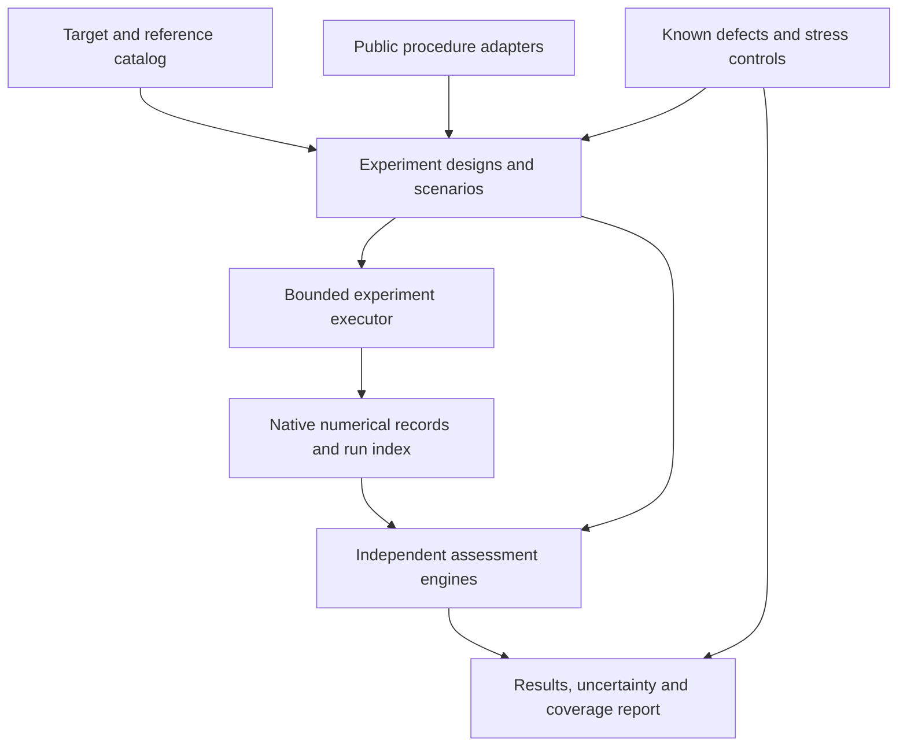

# Inference validation infrastructure, starting with the HMC pipeline

Date: 2026-09-15. Status: revised after independent architecture review;
implementation authorized by the owner. The bounded execution specification is
[recorded separately](bayesfilter-inference-validation-execution-2026-09-15.md).
Implementation and bounded development execution are recorded in
[the terminal audit](bayesfilter-inference-validation-infrastructure-execution-result-2026-09-16.md).
This is not a completed statistical certification campaign; that audit lists
the remaining reference, target, power and stopping-comparison work.
The active [continuation plan](bayesfilter-inference-validation-phase2-plan-2026-09-16.md)
turns those gaps into ordered prerequisites, evidence requirements and explicit
funding states. Its immediate execution is an offline readiness check; a larger
statistical campaign was not funded by the small remainder of the first budget.
The subsequent owner allocation is now covered by the
[24-hour-per-device campaign](bayesfilter-inference-validation-24h-campaign-2026-09-16.md).
Its [execution findings](bayesfilter-inference-validation-24h-result-2026-09-16.md)
include a native ordinary-search availability problem, complete missing-fit
accounting, complete prepared-route rank evidence, and actual stopped/fixed
comparisons with a missed-mode counterexample to local posterior readiness. A failed difficult case is a
recorded finding, not completion of the remaining calibration or consumer work.
This is the integrated design requested after the
[validation standards survey](bayesfilter-hmc-validation-standards-review-2026-09-15.md).
It supersedes that note's implementation ordering, while preserving its source
review and findings about current coverage.

## Objective and scientific questions

Build a reusable validation system in which a model, its independent reference,
a failure mechanism, and a statistical experiment are declared once and used
across numerical unit tests, full pipeline tests, and replicated research runs.
The output must show what was tested, which defects the tests can detect, and
which questions remain unanswered. A collection of passing scripts is not an
adequate substitute.

The system should answer six separate questions:

1. Does the numerical implementation compute the specified density, score,
   transform, metric, and transition?
2. Does a frozen transition preserve the specified target distribution?
3. Does the tuner execute its declared candidate search and handle difficult
   cases, partial evidence, and failures correctly?
4. Does the complete inference procedure recover the intended conditional
   distribution across simulated datasets and fixed reference problems?
5. Do warmup and retained-precision decisions have useful, measured behavior
   under transients, dependence, heavy tails, and incomplete exploration?
6. Can the validation system detect specified incorrect implementations without
   an excessive false-rejection rate?

HMC is the first implementation. The reusable concepts may later support other
inference algorithms, but this proposal does not expand into a new filtering,
training, or general benchmark framework. In particular, frozen-transport HMC
validation does not establish the quality of transport training. A future
training-inclusive experiment would declare and rerun training explicitly.

## Architecture: common definitions and evidence, distinct experiments



One command family should resolve, execute, assess, and report a declared suite.
It must support different data-generating experiments rather than attach every
diagnostic to an ordinary chain. Gandy–Scott tests, SBC, reference-posterior
comparisons, and stopping-rule calibration require different simulation designs.
Their common infrastructure is target identity, references, execution records,
statistical design, and reporting.

The executor schedules independent validation jobs. It calls the existing
BayesFilter tuners and posterior runner; it does not implement another candidate
search, adaptation loop, admission rule, or retained sampler.

### Shared definitions

Use a small set of explicit Python records and protocols, with JSON for saved
configuration and results. The names below are proposed interfaces.

| Definition | Required meaning |
| --- | --- |
| `TargetSpec` | Model-coordinate density and support; parameter names and dimensions; data/prior definitions; coordinate transforms including Jacobians; target factory; optional proper prior/data simulator; available scientific functionals; known moment conditions; source and version |
| `ReferenceSpec` | Exact formula, independent sampler, numerical solution, or Monte Carlo reference; precisely which density and quantities it represents; numerical/Monte Carlo uncertainty; independent/shared implementation dependencies; generation procedure and source |
| `ScenarioSpec` | Target instance, start regime, geometry/scale setting, execution route, dtype/device/XLA setting, declared resource limits, and any controlled failure or mutation |
| `ValidationDesign` | Question, experimental unit, required inputs, reference/comparator, null or accuracy criterion, meaningful defect size, diagnostic roles, dependence handling, multiplicity/sequential rule, replication/seed policy, budget, and expected behavior |
| `RunRecord` | Resolved design, actual invocation and source state, dataset/replication IDs, native tuning/candidate/posterior record paths, execution status, timing and resources, all attempts and failures |
| `Assessment` | The particular question and quantity assessed, method/version, valid sample units, estimates and uncertainty, discrepancy/accuracy finding, test power evidence, missing evidence, and exact supporting run records |

One model can have several references. An analytical score oracle is not a
posterior oracle. A simulated generating parameter is not the posterior mean.
An exact Kalman likelihood is not an analytical posterior over unknown Kalman
parameters. These distinctions must be represented explicitly, not inferred
from a field called `truth`.

The density executed by an approximate filter and the scientific model it
approximates are separate targets for validation. Sampling the implemented
density accurately and approximating the scientific posterior accurately need
separate comparisons. Reference availability and uncertainty must be checked
per quantity and scenario.

### Procedure adapters and observation boundaries

Use `HMC_TUNING_INTERFACE_CAPABILITIES` and the
[public interface](../reference/hmc-tuning-interface.md) as the route authority.
Provide narrow adapters for:

- ordinary automatic preparation and candidate-set tuning;
- already prepared exact HMC, explicitly labeled as that narrower scope;
- supported frozen-transport preparation and candidate-set tuning;
- individual frozen transitions for mathematical and invariance tests;
- the verified-member bridge and `run_hmc_posterior`;
- conditional position-field mechanics, preserving its current authority limits;
- optional external reference execution/readers for Stan, PyMC and R tools.

Capture preparation, pilot, measurement, verification, candidate ancestry,
budget decisions, warmup, and retained chunks using existing records. Add a
minimal observation hook only if a required invariant cannot be recovered from
those records. Observation hooks cannot alter decisions. Controller-only test
doubles remain explicitly labeled; only calls through the numerical public
route count as full numerical pipeline coverage.

All verified candidates remain in the record. Small full-pipeline cases assess
every verified member. A larger campaign may declare a subset of members for
expensive posterior validation, but the report must show the remainder as
unassessed for that purpose. This sampling of validation work must not delete
members, nominate a production winner, or imply every member was validated.

## Synthesis of the surveyed methods

The following engines are all part of the target architecture. The sequence of
implementation is a dependency order, not a reduction of scope. Source IDs
refer to the inspected papers and code in the
[survey's source inventory](bayesfilter-hmc-validation-standards-review-2026-09-15.md#sources-inspected-and-provenance).

| Engine | Experimental design and source | Its output and limit |
| --- | --- | --- |
| Numerical mechanics | Independent value/score/transform formulas; leapfrog reversal and energy checks; metric and adaptation-state tests, following Stan/PyMC [S1–S5] | Error relative to a specified calculation, invariant satisfaction, and dtype/scale tolerance; no posterior convergence inference |
| Fixed-kernel invariance | Gandy–Scott two-sample and reversible random-position rank designs [S6–S7] | Distributional discrepancy tests with their stated null calibration; no claim of useful movement or mixing |
| Candidate-search behavior | Independently specified controller event sequences and real numerical stress cases | Candidate-set completeness, per-L repair/verification, correct health decisions, budget/restart behavior, and acceptance-screen operating characteristics |
| Full-procedure SBC | Prior/data replications, complete refits, ranks of parameter and data-dependent quantities; Talts and Modrák [S8–S10] | Calibration findings across the declared generative model, with completion rates and dependence limitations |
| Reference posterior assessment | Analytical/iid/Monte Carlo references and curated `posteriordb` problems [S11] | Errors in moments, covariance, quantiles, mode probabilities and scientific functionals, including reference uncertainty |
| Diagnostic and stopping assessment | Exact stationary processes, controlled transients, and repeated complete runs; compare relevant Stan/PyMC/R/Dynare diagnostic definitions [S1–S5, S12] | Estimator arithmetic, false readiness, unavailable estimates, error/coverage at actual stopping, and cap/completion rates |
| Validation power assessment | Correct implementations plus independently checked, deliberately incorrect variants; Gandy–Scott supplies statistical-testing precedent [S6] | False rejection and detection probability with uncertainty, indexed by defect and severity |

### Numerical mechanics and search mechanisms

Mathematical tests need independent oracles. Reusing the production diagnostic
helper to compute the expected answer would only test plumbing. Include:

- density/score agreement and coordinate chain rules, support and Jacobians;
- mass versus inverse-mass conventions and momentum covariance;
- kick/drift updates, reversibility, full Metropolis energy, and numerical health;
- geometry preparation and short/degenerate adaptation windows;
- frozen geometry/step size after adaptation;
- repeated states, two-cycles and near resonance;
- chain permutations, coordinate transformations, and chunk/restart equivalence
  under explicitly matched numerical and seed contracts.

Property tests should generate admissible small cases and preserve a minimal
failing example. Mathematical equivalence does not require identical adaptive
trajectories: affine reparameterizations should recover the same distribution
in model coordinates, while their tuning paths may differ. Gradient-oracle
tests and MH invariance tests remain separate: a wrong proposal force can still
give invariant sampling when correction and proposal properties are valid.

For the controller, a declarative scripted evaluator should specify observable
work and outcomes independently of the implementation. Enumerate multiple
surviving families, same-L epsilon children, nonmonotone acceptance, all-member
verification, budget edges, released reserves, inconclusive evidence, and
candidate-local versus shared failures. Replay those obligations through real
targets where a numerical experiment is needed. Fault-injected event tests do
not by themselves demonstrate numerical recovery.

Calibrate the acceptance screen near its decision boundaries using independent
reference measurements under the same starts and observation protocol. Report
false qualification, false rejection and inconclusive rates, including the
actual evidence-rung policy. The current compatibility intervals do not become
nominal sequential confidence intervals because this infrastructure exists.

### Invariance and SBC designs

Implement the Gandy–Scott designs as explicit generators. For Algorithm 1 the
statistical observations are independent joint parameter/data samples; for
Algorithm 2 they are independent replications of the random-position rank
construction with tie handling. Freeze settings before test transitions. If
preparation depends on the data, it must be independent of the oracle state
conditional on those data. Do not apply a frozen-kernel theorem to a freely
adapting trajectory.

SBC should have a separate generative runner that executes the whole declared
procedure for each simulated dataset. Include joint log likelihood and relevant
derived quantities, not just marginal parameters. Check simulator and target
agreement against independent formulas. Preserve difficult/failed fits in the
run inventory and report their frequency and cause.

The generating parameter belongs to the assessor. Ordinary full-procedure SBC
must initialize and tune from observed data and independent algorithm randomness,
without receiving that parameter or exact posterior draws as privileged starts.
Oracle-initialized transitions belong to the separate invariance experiment.
Otherwise a nonmoving implementation could inherit correct samples from the
test and conceal a failure that ordinary users would encounter.

Both engines must declare their independence unit. An MCMC transition, a
candidate sibling, a chain, and a simulated dataset are not interchangeable
replications. Ordinary SBC ranks require an appropriate treatment of MCMC
dependence. A profile claiming an exact null must satisfy the exact construction;
a thinning-based approximation must be labeled and calibrated for the relevant
scenario. Do not use an ordinary permutation test on consecutive MCMC draws.

Candidate sets need particular care. Keep ranks/errors for every assessed
member, linked to its dataset and tuning record. Do not concatenate all sibling
ranks and call them independent. Formal SBC profiles must predeclare stable
reporting groups and a member rule within each group, based only on tuning
records and independent validation randomness, not the generating truth or
retained posterior performance. For example, a profile can assess each declared
L family separately while retaining every sibling's descriptive/reference
assessment. Missing families remain explicit outcomes. Inference across groups
uses a declared multiplicity rule; dataset-level summaries must respect the
within-dataset dependence. The testing rule does not change production
candidate retention or supply a nominee.

For the first formal SBC engine, use independent complete fits conditional on
each dataset, selecting one output by a fixed rule from each fit. This makes
the fit, rather than a correlated retained transition, the draw unit. Under
the null each output must have the intended conditional posterior distribution;
independence alone does not guarantee correctness. Use the same predeclared L
group/member rule in each fit. If a required fit/member is absent, retain the
dataset as unavailable and mark the aggregate calibration incomplete. Do not
claim unconditional calibration from success-only ranks. Longer single-fit
rank diagnostics are descriptive until their dependence adjustment is justified.

The SBC rank engine itself needs exact iid reference inputs, randomized-tie
fixtures, ignored-data negative controls, and dependence controls. The inspected
R `SBC` diagnostic aggregation is not a prior audit of its rank implementation;
that implementation/source comparison is a specific prerequisite to claiming
parity. Likewise, inspect the actual `mcunit` sequential implementation before
claiming parity with the paper's wrapper.

### Reference accuracy and stopping decisions

Use reference providers in this order where available: exact formulas,
independent exact draws, numerical references with error bounds, and separately
validated Monte Carlo references. This is an order of evidence quality, not a
claim that every problem supports all four. Check reference metadata and actual
density/coordinate agreement before reuse. Two software packages agreeing does
not rule out a shared model error.

Posterior assessment should examine means and squares, covariance/dependence,
quantiles, tail/mode probabilities, and user-declared scientific quantities.
Record the moment assumptions of each statistic. For example, a Cauchy case
supports quantile/CDF checks but not finite-mean accuracy claims. Distance tests
also have assumptions; do not apply an unbounded-moment criterion indiscriminately
to heavy tails. Prefer bounded quantities where that makes the test meaningful.

Diagnostic assessment has two experiments. First, evaluate the diagnostics on
known stationary or deliberately nonstationary arrays to check arithmetic and
specific responses. Second, run the actual posterior controller repeatedly from
declared start regimes and assess its stopped outputs against a reference. The
second experiment measures false readiness, final error, interval coverage
where claimed, completion rates, and cost, including capped/failed runs.

Compare stopped and fixed-length procedures on the same target and declared
experimental units. Lugsail and other MCSE estimators should be assessed on
positive/negative autocorrelation, short histories, insufficient batches,
constant/rare-event quantities, and moment violations. A local precision pass
cannot establish exploration of an unseen mode. The reference engine must
remain able to disagree with the controller's favorable report.

Dynare's Geweke, Brooks–Gelman and Raftery–Lewis outputs can be optional
comparison diagnostics on eligible inputs. They are not added as mandatory
tuning requirements or combined into a vote that supposedly proves burn-in.
Before implementing any new estimator or claiming external parity, inspect its
technical source and actual implementation. The survey checked the Dynare
manual, not every implementation routine.

## Target catalog, scenarios and coverage

The catalog should contain reusable families, not a growing list of scripts
with hardcoded data and settings. The declared scenario parameters carry their
provenance and purpose; a broad grid is not automatically a justified test.

| Family | Required distinct mechanisms and references |
| --- | --- |
| Gaussian/quadratic | Isotropic, anisotropic, rotated and condition-number cases; exact score, energy, moments and transitions |
| Known nonlinear transforms | Banana and nonconstant-Jacobian transforms; exact change of variables and iid reference draws |
| Hierarchical geometry | Funnel plus centered/noncentered eight schools; direct reference draws where available and matched model-coordinate references |
| Heavy tails | Student-t and Cauchy; explicit moment domains and exact CDF/quantile references |
| Multiple modes | Separated mixtures and unequal weights; known mode probabilities and starts both within/across modes |
| Constrained parameters | Positive, interval and simplex cases; Gamma/Beta/Dirichlet references and transform identities |
| Generative conjugate models | Normal and Beta-binomial models; exact conditional posteriors and independently checked simulation |
| Regression and hierarchy | Curated `posteriordb` cases, complete data/prior/coordinate mappings and reference uncertainty |
| State-space models | Generative LGSSM with Kalman likelihood/score oracles, then separately validated nonlinear/consumer targets |
| Actual MacroFinance consumer | Explicit supported route, prepared-data/prior identity and scientific quantities; current implementation and approximation errors kept separate |

Cross these families with mechanisms, public execution routes, starting regimes,
numerical environments, and evidence types. Declare required intersections
explicitly. Pairwise coverage can supplement this design but cannot replace
known interactions such as nonlinear transport × Jacobian × retained replay,
or same-L repair × budget release × resume. Do not blindly execute the full
Cartesian product. It would spend compute without ensuring useful evidence.

Coverage reports must distinguish planned, executed, applicable-but-unfunded,
inapplicable-with-reason, stale, and failed cells. A model name alone is not
coverage. An automatic-tuning cell cannot be satisfied by a supplied-pair run;
a GPU/XLA cell cannot be satisfied by CPU/non-XLA evidence. A registry entry
describing an interface as supported does not replace these findings.

## Testing the tests with controlled defects

Create a catalog of test-only mutations and stress controls. Each identifies
the changed operation, intended target, known consequence, relevant detection
engine, and severity range. Keep variants isolated from production execution;
mutations must not alter the reference oracle. Use small wrappers/test doubles
or isolated source copies as appropriate, preserving the unmodified baseline.

The initial catalog includes omitted nonlinear Jacobian, incorrect MH energy,
inconsistent metric convention, incorrect score, ignored data, duplicated
streams, warmup leakage, lost eligible candidates, cross-L epsilon transfer,
and missing/duplicated restart chunks. Add identity/no-movement and two-cycle
controls, which test exploration despite valid invariance. A hard model that
mixes slowly is a stress case, not automatically an incorrect implementation.

Every statistical engine needs measured false rejection on a checked correct
implementation and detection power against relevant defects, with uncertainty.
A mutation is detected only when the intended oracle responds, not when an
unrelated import error or device failure aborts its run. Record the actual
defect activation. A wrapper intentionally performing a no-op mutation should
behave like the baseline, helping expose wrapper-induced differences.

Keep three results distinct: whether the execution was valid, what the sampler
or diagnostic did, and whether the validation test responded as expected.
Detecting an intentionally broken sampler is a successful validation test and
an unfavorable sampler result. It must never become a passing sampler row.

## Statistical decisions and bounded execution

The assessment engine must distinguish detecting discrepancy from establishing
accuracy. Failure to reject equality is not evidence of practical equivalence.
An accuracy claim needs a declared tolerance and an uncertainty bound appropriate
to its estimator/reference. An invariance test can report no detected discrepancy
at its stated power without declaring universal correctness.

Before a replicated run, the design must specify:

- independent experimental units and all within-unit dependence;
- functional-specific tolerances or defect sizes and their scientific rationale;
- test size, multiplicity family and any planned sequential looks;
- replication allocation justified by power/error precision and measured cost;
- random streams for data, preparation, transitions, references and test calibration;
- budget, attempt accounting, and stopping/repair conditions;
- which statistics are criteria, vetoes, repair triggers or explanation only.

The statistical family includes the declared models/quantities/groups, not an
unstated single p-value selected after looking. A fixed seed aids reproduction
but does not calibrate false rejection. Re-running until a test passes is not a
valid sequential rule. Gandy–Scott's wrapper is usable only with its specified
stage assumptions; existing tuning evidence rungs are not that wrapper.

Keep development/calibration replications separate from confirmation. Changes
to a diagnostic threshold, test quantity, tuner setting or mutation-sensitive
test after inspecting results require fresh declared confirmation evidence.
The same distinction applies to choosing a new default. Shared simulated data
can support a planned paired comparison, but paired data do not imply that
different sampler implementations consume matching random transitions.

The executor resolves a design without importing GPU frameworks, checks its
required references and assumptions, and prints the funded jobs and exclusions.
It then runs bounded workers with the appropriate CPU/GPU and memory-growth
settings established before import. Reuse the native sampler checkpoints;
campaign resume only schedules unfinished jobs and does not count a repeated
artifact as a new replication. Local infrastructure retries preserve failed
attempts and consume the same campaign budget. A source/method change starts
a new evidence version rather than silently joining old and new draws.

Use existing run manifests, ordinary source hashes, and versioned output
directories. Record commit plus relevant worktree source state, commands,
environment, hardware and memory policy, data version, seeds, compile/sampling/
analysis time, resources, plan and result paths. Budget writes should be owned
by the coordinator, rather than assuming an existing ledger supports arbitrary
concurrent writers. No new approval-token or launch-authority machinery is needed.

Research-direction stopping is separate from candidate failure. Invalid target
definitions, broken references, invalid device execution, corrupted records or
exhausted budget stop the affected experiment. A deliberately difficult
candidate failing its declared checks is an outcome; it does not stop other
valid jobs or a planned repair designed for that failure.

## Repository integration and concrete implementation shape

Place the reusable system under `bayesfilter/testing/inference_validation/`.
It is a test/diagnostic package and must not be imported by inference runtime
decision paths. TF/TFP remain the numerical execution backend; independent
reference implementations remain explicitly diagnostic and separate. Do not
copy numerical inference code into this package.

```text
bayesfilter/testing/inference_validation/
    catalog.py                 # target/reference/scenario definitions
    designs.py                 # experiments, units, assumptions and policies
    procedures.py              # narrow adapters to existing public execution
    controls.py                # isolated mutations and stress controls
    execution.py               # bounded jobs, native record indexing, resume
    engines/                   # mechanics, invariance, SBC, accuracy, stopping
    references/                # independent formulas and external readers
    reporting.py               # assessments and required-coverage matrix
    __main__.py                # one command family
tests/inference_validation/    # implementation and harness regressions
docs/validation/               # declarative suite definitions and generated reports
```

These paths are proposed. Prefer explicit registration and small protocols over
a dynamic plugin framework. External libraries are optional reference providers;
ordinary unit tests must not install them or require network access. Saved
external references need source/version/uncertainty checks, and new external
execution requires its declared environment and budget.

Proposed command responsibilities:

| Command | Behavior |
| --- | --- |
| `list` | Show target families, mechanisms, routes, designs and missing capabilities without numerical execution |
| `plan` | Resolve an explicit suite and budget into jobs, assumptions, statistical families and uncovered cells |
| `run` | Execute that resolved design, optionally resuming unfinished jobs, through existing public procedures |
| `assess` | Recompute versioned assessments from preserved eligible observations; new analyses are labeled exploratory unless predeclared |
| `report` | Generate human-readable findings and machine-readable coverage with direct evidence links |

### Reuse and migration boundaries found in the worktree

| Existing component | Integration decision |
| --- | --- |
| `hmc_tuning_dispatch.py`, candidate-set bindings and retained runner | Use these as the actual subject under test; preserve candidate IDs and native evidence |
| `hmc_posterior_assessment.py` / `run_hmc_posterior` | Invoke the real controller, but independently evaluate its reported diagnostics and posterior accuracy |
| `bayesfilter/testing` targets and nonlinear fixtures | Reuse suitable laws/factories after checking scope and independence; add proper generative versions where needed |
| `neutra_model_registry_tf.py` | Reuse target metadata selectively; its training recipes, prepared historical geometry and fixture-bound defaults are not a general validation catalog |
| `deterministic_lgssm_exact_target_tf.py` | Existing loader is an 18-dimensional persisted target with fixed observation shape; preserve that fixed-target role and add a generative model for SBC |
| `two_sample_energy_tf.py` | Candidate statistical primitive for independent samples/whole paths; inspect and calibrate its assumptions, shape/compilation behavior and power before reuse; not valid on arbitrary correlated draws |
| `runtime/runner.py`, device/memory helpers, budget ledger and durable checkpoints | Reuse suitable storage, accounting and device utilities after focused compatibility checks |
| Historical Phase 7 campaign machinery | Do not make its fixed identities, CPU launcher and terminal-after-candidate-failure policy the new general executor |
| Existing pytest tests and policy wrapper | Keep regressions; register their actual coverage and add explicit suite selection |

The checked `pytest.ini` registers `extended`, `hmc`, `external` and `gpu`
markers, but registration alone does not make them opt-in. The checked
`conftest.py` sets device policy and contains no selection hook for those
markers. The infrastructure must enforce advertised selection in its commands
and tests rather than assume the marker descriptions already do so. No CI
workflow directory was present in the inspected worktree.

## Reports, guide and operational profiles

The report should lead with findings and unresolved coverage, not the number of
tests. For every question it should show the route/target/scenario, execution
validity, reference, criterion, estimate/uncertainty, finding, detection-power
evidence, and next justified action. Preserve engineering correctness,
numerical/sampler validity and scientific interpretation as separate judgments.

Required views are:

- coverage by mechanism × route × target family × numerical regime;
- candidate search, verification and posterior-assessment completeness;
- reference errors and SBC calibration with completion/failure denominators;
- warmup/precision decision behavior and uncertainty at actual stopping;
- a mutation-detection matrix including undetected defects and null rejection;
- cost and budget consumption, with compilation separated from sampling;
- limitations and stale/inapplicable/unfunded evidence.

Define a fast deterministic profile, a bounded numerical integration profile,
a replicated statistical profile, and an external/consumer profile. They share
definitions and engines. Profile names do not imply evidence strength: each
reports actual coverage and power. Exact budgets are selected from measured
cost and the declared question, not invented in this architecture document.

Generate the guide's tested-model/route table from these records, and add an
explanation of which test answers which scientific question. Keep the public
tuning entry points and R-hat/ESS/MCSE separation unchanged. A successful
validation run does not create an alternate tuning admission path. Documentation
must never turn “no detected discrepancy” or “diagnostics passed” into a general
posterior-correctness guarantee.

## Worked example: one target supports several different experiments

Start with a proper normal model, `theta ~ N(0, tau^2)` and independent
`y_i | theta ~ N(theta, sigma^2)`, with positive known scales. Completing the
square in `theta^2/tau^2 + sum((y_i-theta)^2)/sigma^2` gives posterior variance
`v = 1/(1/tau^2 + n/sigma^2)` and mean `m = v*sum(y_i)/sigma^2`.
This independently derived reference supplies density derivatives, exact iid
posterior draws, moments and quantiles. No particular scale or sample count is
promoted by the example.

The same catalog entry then supports:

| Experiment | What is generated/executed | What is assessed |
| --- | --- | --- |
| Mechanics | Declared positions, momenta and frozen settings | Score `(m-theta)/v`, energy and transition identities |
| Invariance | The Gandy–Scott generative construction and fixed transitions | Rank/joint-distribution identity under the exact posterior |
| Automatic search | Actual public preparation, broad-L measurement, repairs and fresh verification | Complete candidate inventory, required events and immutable per-pair identities |
| Full SBC | Fresh prior/data replications and complete fits using ordinary starts | Parameter and log-likelihood ranks, candidate-family results and failed-fit counts |
| Posterior accuracy | A fixed dataset and repeated runs of every declared member | Mean, variance, quantile and interval results relative to `m`, `v` and the exact CDF |
| Stopping behavior | The actual controller from declared remote/dispersed starts | Error at stopping, coverage where claimed, cap frequency and consumed work |
| Power | The same declared designs with isolated ignored-data, energy or restart defects | Whether the intended test detects each activated defect |

These experiments share the target and reference implementation. They share raw
observations only when the experimental design permits it. For example, the
ordinary posterior trace cannot be repurposed as a random-position invariance
experiment. The common report explains both the shared evidence and the
remaining distinct work. This is the pattern to repeat for the full catalog;
completing this example alone would leave hierarchical, nonlinear, heavy-tail,
multimodal and consumer coverage open.

## Delivery plan and completion criteria

| Milestone | Concrete deliverable | Completion evidence |
| --- | --- | --- |
| Definitions and inventory | Small records/protocols, target/reference registration, route inventory, suite resolution and coverage reporting | An automatic Gaussian case, a supplied-pair case and a controller double appear as distinct coverage; missing/incompatible references fail before simulation |
| Complete vertical implementation | Ordinary automatic tuning through all-member replay and real posterior assessment, with one exact reference and one deliberate defect | One command produces native observations, independent assessments and a report; interruption/resume preserves outcomes and replication identity |
| Mechanics and controller engines | Stan/PyMC-inspired oracles, generated cases, lifecycle specifications and mutation controls | Independent expected values and named faults exercise every required mechanism in their declared route scope |
| Frozen-kernel statistics | Gandy–Scott designs, tie handling, valid test calibration and sequential wrapper where justified | Exact reference controls, invariance-preserving immobility controls, and measured power against target-changing defects |
| Generative inference validation | Full SBC, data-dependent quantities, candidate-family reporting, dependence handling, posterior reference engine | Conjugate baselines plus ignored-data/Jacobian controls; every fit and unassessed member accounted for |
| Diagnostic and stopping validation | Stationary/transient fixtures, MCSE comparisons and replicated actual-controller stopping assessments | Reference errors, unavailable estimates and coverage/completion uncertainty; missed-mode cases demonstrate the limits of local checks |
| Model and consumer expansion | Full target-family matrix, curated posteriordb references, optional external providers and MacroFinance route | Required cells have attributable findings or explicit unresolved status; no legacy result substituted for current numerical execution |
| Operational adoption | Enforced profiles, regression selection, generated guide coverage and documented extension procedure | A new target or defect is added through the common definitions; no new campaign-specific runner, statistic, or report format is necessary |

The vertical implementation is a way to test the architecture early. It is not
completion of the whole plan. Subsequent milestones remain required, and the
report must continue to expose those missing capabilities. Completion means
the declared infrastructure, engines and required matrix are implemented and
evaluated with their planned uncertainty. It does not require every difficult
sampler configuration to succeed; honest detected limitations are valid results.

## Skeptical design audit and assumptions

This is an architectural review, not a stochastic result. No numerical policy
is promoted, and no new test alpha, replication count, runtime cap, acceptance
band, warmup count or model-scale tolerance has been selected. Such choices
must be supplied with provenance and power/cost justification by the resolved
experiment design before research execution.

| Risk examined | Resolution in this proposal |
| --- | --- |
| One generic experiment incorrectly serves every method | Separate design generators; share definitions, execution and observations only where assumptions match |
| A large model list replaces mechanism coverage | Required mechanism/route/scenario intersections and named independent oracles |
| Invariance mistaken for mixing | Identity and recurrence controls plus separate posterior reference assessment |
| Parameter-only SBC or shared simulator bugs pass | Data-dependent quantities, independent simulator checks and ignored-data controls |
| Candidate siblings or chain chunks counted as independent replications | Explicit dataset/replication hierarchy and predeclared candidate-family/multiplicity handling |
| Non-rejection presented as accuracy | Separate discrepancy tests from tolerance-based accuracy claims and power evidence |
| Diagnostic arithmetic validates adaptive stopping | Two separate experiments; actual stopped outputs compared with independent truth/reference |
| Fixed target or known parameter confused with a posterior reference | Typed reference capability, quantity and uncertainty per case |
| Imported statistical code has unchecked assumptions | Source/implementation checks and null/power calibration before eligibility |
| Historical campaign policy or training defaults silently inherited | Reuse narrow utilities and target factories; exclude historical route/default semantics |
| Missing/failed/unfunded work disappears in a green summary | Explicit coverage and availability states, complete denominators and native evidence links |
| Test infrastructure becomes another inference implementation | Public procedure adapters only; independent reference code separated from runtime |
| Framework construction crowds out useful validation | Early complete vertical implementation, followed by explicit engine/matrix completion requirements |
| R-hat returns as a tuning gate through validation | Tuning qualification and posterior assessment remain distinct in adapters, tests and guide |

The reviewed design addresses these risks without adding new governance
ceremony. Before implementation, resolve module interfaces against the then
current source state and preserve unrelated edits. Before each serious campaign,
resolve its experimental design and budget. Localized repairs within that
design remain ordinary engineering work; they do not require another chain of
approval documents.

## Disposition of Claude's architecture review

The 2026-09-15 audit agrees with the architecture and correctly leaves numerical
allocations, statistical primitive calibration and actual execution unproved.
This revision makes the first SBC design, missing-fit interpretation and bounded
execution requirements concrete. Required coverage is materialized as suite
cells; an unexecuted cell cannot satisfy completion.

Two audit descriptions are corrected here without editing the historical review:
an HMC transition is a momentum/proposal/Metropolis update containing L leapfrog
steps, not one leapfrog step. R-hat and ESS are not tuning validity screens;
they may be declared posterior-assessment criteria. The audit's recorded commit
differs from the inspected local HEAD, so its verdict is architectural advice,
not evidence about the current implementation. The plan contains eight delivery
milestones, despite the audit's count of seven.
