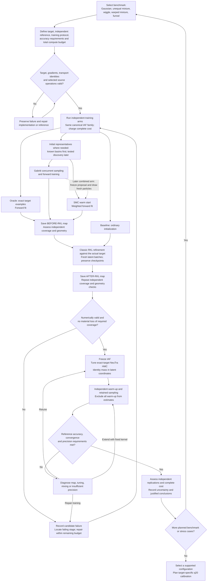
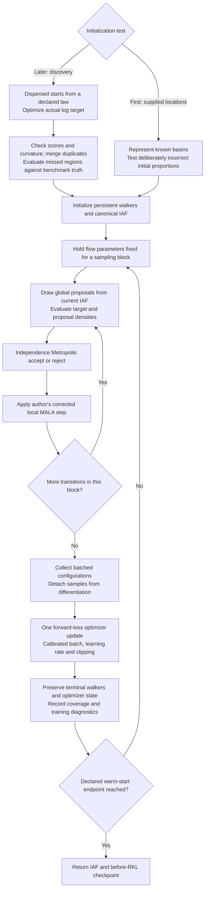
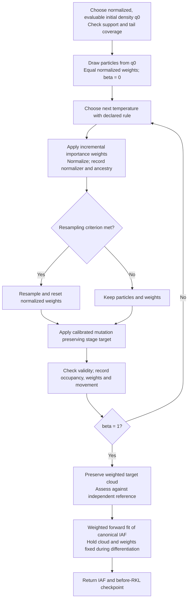

# Proposed NeuTra warm-start algorithm: flowcharts

Algorithm-design companion to
`bayesfilter-neutra-warm-start-canonical-benchmarks-2026-09-29.md`.
Implementation update: the resumable controller is now
`scripts/run_neutra_warm_start_master.py`; its reviewed execution and limits
are in `bayesfilter-neutra-warm-start-master-2026-09-29.md` and the companion
`bayesfilter-neutra-warm-start-master-results-2026-09-29.md`. The diagrams
describe the intended full study, which is not yet validated in full. All
learned final maps use the existing canonical IAF. Gabrié and SMC warm starts
are tested separately first; their composition is a later experiment.

## Complete experiment and estimation loop

The arms run independently. Exact samples are an oracle training input only
where available; otherwise reference information is reserved for evaluation.

Every loop obeys the declared budget. At exhaustion, preserve evidence and
report unresolved results. A failing candidate does not block other valid
arms. Invalid target/reference evidence pauses the affected experiment until
repaired. Exact whitening is not required for useful HMC. Warm-start coverage
problems are recorded before RKL, never silently declared successful; numerical
invalidity is repaired before dependent computation.

## Mode initialization and Gabrié loop

Mode discovery is separate from Gabrié's procedure. Optimizer hit counts and
peak heights are not basin probabilities. On unimodal targets use appropriate
dispersed initialization; a funnel also requires neck/tail diagnostics because
its density mode does not describe its typical probability mass.

The selected author options are `fwd` and `mhmalangevin`, with global then
local moves. The inspected wrapper proposes globally every iteration.
Source parity must preserve dimension scaling of the step size and account
for loss-jump retries, diagnostic random draws and optimizer resets, as
documented in the source-adoption note. The diagram expands the numerical core.

For target `p=gamma/Z` and flow density `q_theta`, global acceptance is

    min(1, gamma(y)*q_theta(x)/(gamma(x)*q_theta(y))).

The forward gradient comes from

    L_F(theta) = -sum_i W_i log q_theta(x_i),

holding samples and weights fixed. Gabrié uses equal weights on its current
walker configurations; their law need not yet equal p. Upstream subtracts
target energy from the reported scalar. That leaves this gradient unchanged
but affects the loss-jump controller, so retain it for controller parity.

## SMC warm start

The expanded diagram is ordinary annealed SMC. The other engines retain
their own author-defined ordering and weighting; they are separate methods.

A possible static-density bridge is

    gamma_beta(x) = q0(x)^(1-beta) * gamma(x)^beta,
    log w_i <- log w_i + DeltaBeta*(log gamma(x_i)-log q0(x_i)).

Beta=1 is the actual target. A rough warm start limits particle/mutation effort;
a partial-temperature cloud instead defines a different training distribution.
For particles drawn from a different known law g0, initialize weights with
`q0/g0`. Optimized centers and old correlated walkers cannot silently replace
draws from q0 with unit weights.

For the later Gabrié-to-SMC arm, freeze the proposal and draw fresh particles
from its evaluable density or a declared normalized defensive mixture. Use
that actual density in the bridge. Coverage and weight variance remain tests.

| Engine | Difference from the ordinary SMC diagram |
|---|---|
| Waste-free SMC | Follow its source population, resampling and trajectory ordering; retain prescribed correlated states and genealogy; they are not independent replications |
| AFT | Learn stage transports on the source-defined populations; correct weights for the transported point and Jacobian, with the prescribed resampling/mutation sequence |
| CRAFT | Keep maps fixed during the pass generating their gradients; update between passes; restart from the declared base and use separate frozen-map evaluation |

For stage transport `y=T_t(x)`, the weight factor is

    gamma_t(T_t(x))*abs(det DT_t(x))/gamma_(t-1)(x).

It replaces the identity-map incremental ratio. The selected algorithm's
training/evaluation separation still matters. Stage maps do not automatically
become the final NeuTra map; this design fits the final IAF to endpoint data.

## RKL and final inference

All warm starts feed the same actual-target objective, up to `log Z`:

    L_R(theta) = E[z~N(0,I)] [log phi(z)
                   - log|det DT_theta(z)| - log gamma(T_theta(z))].

Use fresh latent batches and the checked configured RKL estimator. Detached
forward samples do not provide this pathwise gradient. Preserve the initial
checkpoint to identify coverage lost during refinement. Adding a forward
term is a separate experiment, not a silent repair to classic RKL.

At both checkpoints record the standard 1000-point base score probe and
independent physical-region, tail, density and reference checks. After
freezing the map, the HMC target is

    log gamma_z(z) = log gamma(T_theta(z)) + log|det DT_theta(z)|.

The true unnormalized target stays in the Metropolis correction. The IAF is
a coordinate change, not a replacement posterior. Use the shared fixed-map
tuner and sequential controller with identity mass. Retained estimates need
the declared validity, convergence, precision and reference checks. No new
tempered-estimation or mass-adaptation requirement is introduced here.

SMC² follows separate inner-filter tests against a Kalman or finite-state
likelihood and outer-parameter tests against an independent posterior.
Its data may initialize an IAF, but inference must preserve the corresponding
marginal/extended target. A random particle-likelihood estimate is not
substituted into the deterministic HMC formula above.

Audit: independent controls, source correction formulas, approximate training
data, checkpoint timing and bounded repair loops remain explicit. No new
numerical default, execution budget or scientific result is introduced.
