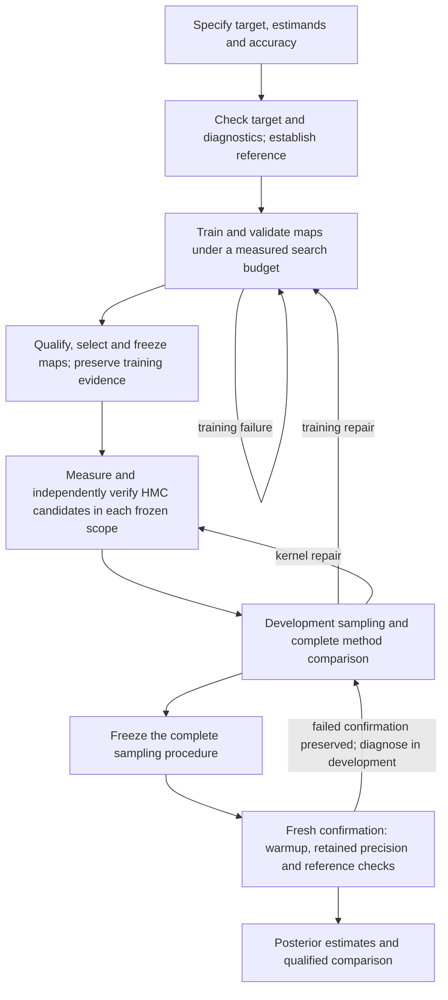

# q20 NeuTra: production pipeline design

Date: 2026-09-15. Status: `DESIGN_PROPOSAL_RUN_CONFIGURATION_NOT_YET_FROZEN`.
Purpose: answer the owner's request for the intended production pipeline after
the [connected-path audit](bayesfilter-ssl-lstm-q20-production-pipeline-audit-result-2026-09-15.md).
This is an implementation and evidence design, not an executed training recipe.
The companion [numerical parameter ledger](bayesfilter-ssl-lstm-q20-production-parameter-ledger-2026-09-15.md)
now specifies current values, proposed searches and the rules for resolving the
remaining choices.
The [mathematical audit](bayesfilter-ssl-lstm-q20-parameter-mathematical-audit-2026-09-15.md)
adds the rationale, assumptions, falsification checks and failure explanations
for every parameter, including explicit unsupported constants.

Production quality means a reproducible path from a specified posterior target
to estimates with checked numerical validity and declared Monte Carlo accuracy.
For a claim that NeuTra is useful, it also means a fair comparison that includes
training and tuning cost. A finite loss, a restored checkpoint, a verified HMC
kernel, and a converged-looking chain answer different questions; none substitutes
for the others.

## The connected pipeline



The repair arrows consume remaining budget and fresh development/confirmation
streams. They never permit changing a frozen kernel inside retained sampling,
discarding an unfavorable retained prefix, or retrying the same confirmation
until it passes. Numerical corruption stops the affected scope for repair.
When a problem appears, use the owner's
[required first checks](bayesfilter-ssl-lstm-q20-parameter-mathematical-audit-2026-09-15.md#first-checks-when-a-run-has-problems):
verify what actually ran and its numerical validity, then examine and test the
uncalibrated quantities implicated by the symptom. Record the explanation,
controlled contrast, uncertainty and next action in the existing result note.
Do this before extending an expensive failed run or attributing its failure to
the research method. A documented setting is still a hypothesis until the
relevant evidence supports it; do not relax a threshold just to obtain a pass.

| Stage | Required computation | Condition for the next stage |
| --- | --- | --- |
| Target | Freeze data, likelihood approximation, prior, parameter transforms and scientific quantities | Value/score and model meaning are explicit; accuracy requirements are recorded |
| Numerical foundation and reference | Check target derivatives, batching, map algebra, diagnostic formulas and an independent comparator | Supported numerical route and usable reference evidence, with approximation limits |
| Training | Positive-temperature reverse-KL learning, target-specific capacity/optimizer/budget exploration, independent seeds | A measured training history and validated frozen candidates; no mandatory tiny endpoint |
| Map qualification | Independent numerical reliability and validation of training progress, geometry and coverage | Useful candidates are nominated without claiming a posterior from training diagnostics |
| Kernel tuning | Public candidate-set procedure in the exact frozen coordinates | Each retained member has its own mechanics measurement and fresh verification |
| Development posterior experiment | Discarded equilibration, cumulative retained precision, reference agreement and matched baselines | A complete procedure is selected before final evidence is inspected |
| Untouched confirmation | Fresh random streams and starts, same frozen target/maps/kernel policy, full assessment | All declared numerical, posterior and accuracy requirements pass; caps yield an honest incomplete result |
| Delivery | Estimates, uncertainty, provenance, costs and limitations | Distinguish valid estimates, useful transport, and supported method preference |

## 1. State exactly which posterior and which answers

Keep the current q20 task unless the owner changes it: four free parameters in
a synthetic SSL-LSTM model with 60 internal filtering coordinates and horizon
30. The likelihood is the declared UKF Gaussian-innovation approximation.
Correct sampling of that posterior does not establish accuracy of the
approximation to the underlying nonlinear latent-model posterior.

Name the four parameter means and relevant quantiles, the existing declared
sign-region probability, and any predictive quantities needed by the research
question. Use scientific names, units, and named array indices. The historical
sign-region contract uses physical coordinate index 2; bind it to the actual
parameter name rather than relying on ambiguous numbering. Sign regions are
declared regions, not a proof of two exhaustive posterior modes.

Freeze absolute or relative MCSE requirements for each reported quantity and
scientifically meaningful margins for reference/start-stratified equivalence.
Those tolerances are not established by the current artifacts and must be
chosen before claim-bearing execution. A missing accuracy requirement must be
reported as missing, not silently replaced by a library default.

Training, validation, development and confirmation partitions are independent
random streams and banks for the **same observed-data posterior**. Splitting
the likelihood observations would change the inference problem. Predictive
evaluation on separately held-out observations is a distinct model-evaluation
question when such data exist.

## 2. Validate the numerical foundation once, then preserve it

Close the reproduced R-hat defects against published formulas and independent
fixed-array/saved-draw references. Verify value and total score of the same
finite target on local derivative checks, difficult parameter points, and
relevant numerical branches. Check batch-native/scalar-reference parity,
CPU/GPU and XLA parity where applicable, transform inverse/log determinant,
and analytic frozen-map pullbacks. A custom-gradient wrapper cannot repair an
incorrect upstream score.

Use the same implementation and complete data/model/prior identity throughout
training, tuning and sampling. Stabilization, covariance repair, dtype and
backend changes must retain their stated finite-program meaning and be checked.
Reuse unchanged, valid engineering evidence. Small smokes test plumbing and
cost; they do not select a production training endpoint.

Establish an independent reference for the same approximate-likelihood target.
For this four-parameter target, assess the feasibility of numerical integration
with explicit domain/tail/refinement error or an independently implemented,
well-validated sampler with its own Monte Carlo uncertainty. A tuned classical
chain sharing the same target code is a useful comparator, but is not by itself
an independent proof of the target implementation. No unvalidated sampler or
finite grid becomes ground truth by naming it a reference. Accuracy relative
to the original latent model remains a separate approximation study.

## 3. Train and validate the transport

Use GPU TensorFlow/TFP with stable batched XLA numerical kernels, memory growth
configured before initialization, and a batch larger than one. External sample
generation uses the existing multicore CPU policy when needed. Do not update
the transport through scalar target loops or silently drop invalid training rows.

Start with the Gaussian-prior affine map. For `z ~ N(0,I)`,
`theta = prior_center + 4 z` has the declared diagonal Gaussian prior by the
linear change-of-variables identity. Verify the beta-zero bridge endpoint and
status semantics rather than spending a generic optimization budget there.
This was already specified in the [older calibration plan](bayesfilter-ssl-lstm-q20-tempered-rkl-transport-ensemble-phase8-calibration-subplan-2026-08-29.md);
the six-update recovery builder did not preserve that procedure.

The plain NeuTra baseline trains directly at beta one. The continuation and
ensemble candidate trains at its declared positive temperatures with a genuine
final beta-one learning allocation. Use the existing reverse-KL objective,
including the Jacobian term, before testing added losses. Any changed objective
is a named method hypothesis and needs a matched comparison.

Make objective scaling explicit. Let `ell_beta(theta)` be the frozen
unnormalized log target, `q0=N(0,I)`, and `theta=T_phi(z)` an invertible map.
Change of variables gives
`log q_phi(T_phi(z)) = log q0(z) - log|det J_T_phi(z)|`, hence

```text
L_beta(phi) = E_z[log q0(z) - ell_beta(T_phi(z)) - log|det J_T_phi(z)|]
KL(q_phi || p_beta) = L_beta(phi) + log Z_beta.
```

The unknown normalizer `Z_beta` is constant with respect to map parameters.
The batch mean estimates this expectation; gradients must include both the
target-through-map and log-determinant terms. Check loss/gradient scaling on a
tractable target before q20 training. Scaling just the likelihood or Jacobian
term changes the objective; it is not merely an optimizer adjustment.

Training protocol requirements:

- Measure compilation, steady update, validation, checkpoint and target-call
  cost for the actual target/batch/device before allocating the search.
- Investigate capacity, batch size and optimizer settings on q20. The existing
  `(16,16)` and `(32,32)` architectures and learning rates are warm-start
  hypotheses.
  They are not established production choices. Record Adam parameters, clipping,
  scale caps, activation, permutations and initialization.
- Use predeclared increasing training-budget rungs within a finite maximum.
  Their sizes and validation cadence come from measured cost and observed
  learning time scales. Neither six updates nor the historical `(8,32,128)`
  pilot ladder is a universal stopping rule.
- Track paired validation objective changes and their Monte Carlo uncertainty,
  not individual noisy training losses. Repeatedly inspected banks are selection
  data. Keep final confirmation streams independent of that selection.
- Diagnose continuing improvement, a plateau, clipping, collapse, numerical
  failure and capacity limits separately. A poor plateau triggers a declared
  optimizer/capacity/temperature repair. Reaching the training cap while the
  important questions remain unresolved is an undertrained/inconclusive result.
- Replicate independent map initializations. The number of seeds and budget
  per seed must support the intended uncertainty claim; a few seeds may only
  justify candidate nomination. Choose the checkpoint under the declared
  validation rule, not automatically the last update or lowest noisy loss.
- Preserve every loss, raw/clipped gradient norm, clipping flag, target-call
  count, elapsed cost and validity result. Training checkpoints include weights,
  Adam slots/iterations, temperature position and random-stream state. A reset
  between temperatures is an explicit protocol option; an interrupted update
  cannot silently reset Adam on resume.

Adequate training is demonstrated by the combination of learning evidence,
validated numerical reliability, capacity/optimizer checks and downstream
behavior. A plateau alone, a prescribed count alone, or low reverse-KL alone
cannot establish it.

## 4. Qualify and freeze maps before expensive sampling

Use numerical round-trip/log-determinant/score checks, independent validation
loss, latent means/covariances, transformed score residuals and curvature, and
coverage stress tests. Include reference points outside each map's own common
samples and cross-chart checks for an ensemble. Validation only on samples
drawn from the learned map can miss regions that the map failed to learn. If
reference points guide training, classify them as development data and preserve
an independent final comparison.

Whitening diagnostics must use `z=T^{-1}(theta)` for independently validated
posterior draws, with their Monte Carlo uncertainty. Applying `T^{-1}` to
`T(z)` for generated Gaussian draws tests the inverse; it cannot show that the
posterior is whitened. Inspect latent covariance, tails and region coverage,
and the residual `grad_z ell_z(z)+z`, which vanishes for a standard Gaussian
target. Unit covariance alone does not establish Gaussian shape or coverage.

A map does not need to transform the posterior into an exact standard Gaussian
for Jacobian-corrected HMC to be valid. Geometry tests establish training progress
and nominate useful candidates; posterior correctness and computational benefit
are tested downstream. Do not invent a universal Gaussianization threshold.
With a frozen map the latent log target is
`ell_z(z) = ell_beta(T(z)) + log|det J_T(z)|`; its score is
`J_T(z)^T grad_theta ell_beta(T(z)) + grad_z log|det J_T(z)|`.
These follow from change of variables and the chain rule, and must be checked
through the actual sampler consumer. Correct transformed density does not imply
that a finite chain has explored it adequately.

Freeze each nominated map with its target, objective, architecture, weights,
training/validation history and selection reason. The real setup and resume
consumer must load that trained-map record. It must not call the preflight
builder to manufacture missing weights. Smokes may use tiny unqualified maps
only with an explicit smoke role that cannot produce final research output.

## 5. Tune each frozen scope through the supported public interface

The currently inspected main interface uses one candidate-set lifecycle:
`tune_hmc_kernel` for ordinary coordinates and
`tune_fixed_transport_hmc_kernel` for supported frozen maps. Consult
`HMC_TUNING_INTERFACE_CAPABILITIES` and the
[current reference](/home/ubuntu/python/BayesFilter/docs/reference/hmc-tuning-interface.md)
at the revision selected for implementation. Main's combined repair now has a
[terminal engineering result](/home/ubuntu/python/BayesFilter/docs/plans/bayesfilter-hmc-overall-repair-result-2026-09-15.md).
Its Gaussian/test evidence does not qualify q20 map conversion, target-scale
performance or posterior inference.

Measure a predeclared range of trajectory lengths with their own step sizes,
including bounded repairs, then independently verify every survivor. Record
all verified candidates. Acceptance compatibility and numerical health qualify
mechanics; short-chain ESS, R-hat and runtime do not rank or admit tuning members.
Both too-short travel and unstable steps need investigation. Shrinking epsilon
at fixed L changes travel and is not a general remedy for residual geometry.

Every `(target, beta, chart, mass, dtype/backend)` scope needs its own tuning.
The supported frozen-map interface uses identity mass in latent coordinates.
Ordinary HMC may learn its own metric during preparation. A residual latent
metric would require a supported, explicitly defined extension; it cannot be
quietly inserted into the current frozen-map interface. Changed maps or metrics
invalidate their previous tuning scope.

The current q20 checkpoint uses a reference-affine weighted dense IAF. The new
public binding reconstructs frozen maps via `load_frozen_neutra_artifact`.
Prove an exact export/restore path for this composition before migration:
forward/inverse/log-determinant/score parity and one supported tuner-to-retained
consumer check. Relabeling its JSON as a supported schema is not a conversion.
This consumer integration remains required work, not established compatibility.

## 6. Test the complete method in development, then freeze it

Use matched physical starts, target/data/prior, downstream accuracy, hardware
policy and total compute accounting. The minimal useful baseline ladder is
ordinary HMC, independently tuned metric/affine HMC, and fully trained plain
NeuTra. For the existing ensemble research question, also execute matched
physical-coordinate replica exchange and the actual charted/tempered ensemble,
with the bridge, swaps and per-scope tuning preserved. Use single-chart tempering
and cold multiple-chart ablations where needed to identify the mechanism.
Optional joint-mixture learning remains an enhancement after the plain candidate.

Do not substitute a single beta-one chart for the promised ensemble. For an
ensemble, independent chains are independent *replica systems*; hot replicas
are not extra posterior chains. Assess the retained cold stream, declared-region
occupancy, initialization forgetting and replica travel. Swap acceptance or
mixture weights do not establish cold mixing or posterior region masses.

Development chains may nominate an explicit verified candidate for the final
procedure. If an efficiency ranking is claimed, use a predeclared comparison
with uncertainty and valid posterior estimates, including training and tuning
cost. If several configurations are indistinguishable, retain that conclusion
and use a declared operational choice rather than claiming a winner. Freeze
the selected method, map(s), kernels, starts policy, diagnostics, precision
requirements and resource limits before final confirmation.

## 7. Run full posterior confirmation with fresh streams

For a single verified member the current API direction is
`build_retained_bound_hmc_archive_runner_from_candidate_set_result` followed by
`run_hmc_posterior`, not a bare chain runner. The existing exact ensemble
transition must consume the same checked posterior assessment policy; public
single-member support does not automatically establish ensemble integration.

Archive discarded warmup and grow retained samples cumulatively. Start chains
across the declared relevant regions. Preserve the inherited minimum four-chain
contract and use the maximum of correct rank-normalized split/folded R-hat on
physical parameters and required scientific functionals. The owner-policy
warmup defaults (minimum 2,000, recent window 1,000, maximum 10,000, R-hat 1.05)
and retained R-hat 1.01 are operational screens, not evidence of sufficient
burn-in on this target. The old canary maxima of 2,000/1,000 must not define
production sampling. Retain the owner-policy maximum of 10,000 retained
transitions per chain unless a separately justified policy change is made.

Configure positive, justified bulk/tail ESS requirements and **required**
estimand-specific MCSE tolerances. Current library defaults allow
`precision_not_requested`; the q20 production consumer must not call that
sufficient precision. For a mean, `MCSE^2` is asymptotically
`Var(theta)/ESS_mean`, so a relative tolerance `MCSE/SD <= r` requires
`ESS_mean >= 1/r^2`. Rank bulk ESS cannot be substituted for that
original-scale mean ESS. Quantiles and region probabilities need their own
uncertainty calculation; rare unvisited events cannot receive zero uncertainty
merely because their indicator was constant.

Check numerical health and source/target/map identity on every chunk. Additional
callbacks can add checks but cannot replace core health/R-hat/precision checks.
Native divergences, when available, retain their declared veto role. Finite
energy-error magnitude stays explanatory under the current campaign contract;
do not introduce an uncalibrated energy cutoff. Missing mandatory evidence,
corrupt transitions, or nonfinite states are not harmless diagnostics.

Final acceptance requires all declared screens, precision, independent reference
agreement and start/region checks together. Correct R-hat and small estimated
MCSE can both miss a mode shared by all chains; reference/coverage checks address
that separate risk. Repeated looks and correlated warmup windows are operational
checks, not independent replications or anytime-valid confidence guarantees.
Exhausting a cap reports the unmet criterion and preserves all draws.

## 8. Preserve useful results and account for full cost

One production orchestrator must actually execute these stages. Put the reusable
training/assessment behavior in the package, with a thin CLI whose run modes
are explicit. Use shared numerical kernels for smokes and serious runs; a smoke
cannot silently become the default serious configuration.

Use ordinary versioned directories and compact run records: target/plan/source
identity, exact command/environment, seeds, device/memory policy, training and
optimizer state, frozen maps, tuner candidates, all warmup/retained chunks,
diagnostics and terminal decision. Resume exact state within scope. Separate
execution completion, mechanics validity, posterior assessment, requested
precision and comparative conclusions. Always write a terminal failure record,
including why any diagnostic is unavailable.

Charge compile, training, tuning, reference, sampling, analysis and failed
attempts to their stated budgets. The available campaign total is
`135275.83289109988` seconds (37.58 hours), including
`54299.37991617` diagnostic seconds (15.08 hours), with the inherited
`28800`-second per-arm ceiling. These come from the
[owner's allocation](artifacts/ssl-lstm-q20-phase9b-scale-travel-repair-2026-09-15/budget-amendment-r1.json).
No new compute allocation is introduced here.

Reserve complete reference, tuning, development, final confirmation and bounded
repair costs **before** spending the residual budget on training search. Forecast
each stage using comparable measured costs, including validation target calls,
and record uncertainty. Do not divide the grant into unsupported percentages
or assume the six-update canary forecast funds this whole pipeline. If the full
experiment does not fit, its scope/cost decision must be explicit; an incomplete
comparison cannot support the original method claim. No numerical work was
launched while preparing this design.

## Research intent and decision roles

| Item | Active meaning |
| --- | --- |
| Main question | Can properly trained NeuTra, and the declared ensemble enhancement, produce accurate q20 posterior estimates at useful total computational cost? |
| Candidate mechanism | Reverse-KL learned change of coordinates; for the ensemble, multiple frozen charts and exact exchange along the same proper bridge |
| Expected failures | Undertraining, capacity/optimizer limits, reverse-KL undercoverage, unstable steps, short travel, weak overlap, missed modes and unaffordable full validation |
| Promotion criterion | Complete downstream validity/accuracy/reference checks; a claimed advantage additionally requires uncertainty-supported comparison including training/tuning cost |
| Promotion veto | Invalid candidate numerics, missing map qualification, failed posterior/coverage checks, or unmet required precision |
| Continuation veto | Corrupt shared target/score/diagnostic/transition evidence, changed assumptions, unrepairable infrastructure within scope, or exhausted authorized budget |
| Repair trigger | Poor training plateau, persistent geometry/coverage problems, tuning failure, unmet posterior accuracy or candidate-local health failure under a planned bounded repair |
| Explanatory diagnostics | Loss, geometry residuals, acceptance, finite energy errors, raw swap rates and short-chain ESS/runtime; they do not alone promote a method |
| Limits | No claim of exact latent-model inference, exhaustive mode discovery, high-dimensional parameter scaling, global Gaussianization or universal defaults from this q20 experiment |

## Skeptical design audit and remaining implementation work

The design closes the previous conceptual errors: the baseline includes tuned
classical inference; the selected training endpoint is explicit; repeated
validation is separated from confirmation; posterior precision is mandatory;
the whole ensemble must execute for an ensemble claim; and budget limits cover
the whole procedure. It preserves candidate repair without upgrading a failed
promotion screen to rejection of the research direction.

The companion numerical ledger proposes explicit precision/equivalence margins,
training search/rung sizes, seed replication and temperature choices, with
provenance and selection rules. The selected maps, supported q20 bindings,
reference method and complete measured cost allocation remain unresolved.
Freeze the resulting execution configuration before claim-bearing runs; a
large arbitrary update count does not resolve these requirements.

Implementation order: validate the current HMC repair; implement measured
training and complete checkpoints; connect q20 map export, setup and resume;
exercise the real public tuning-to-posterior path; connect ensemble assessment;
then perform the funded development/confirmation experiment. Useful regression
checks must exercise this chain and reject a smoke map, changed target/map,
missing precision requirement and a callback attempting to skip core checks.
Document validation: local links resolve, code fences balance, and whitespace
checks pass. No numerical tests or research runs were needed for this design.
